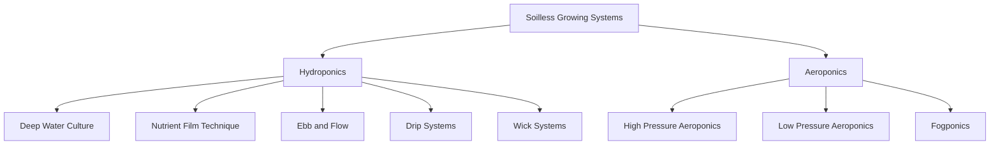
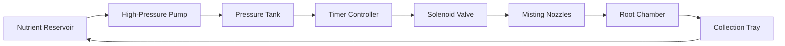
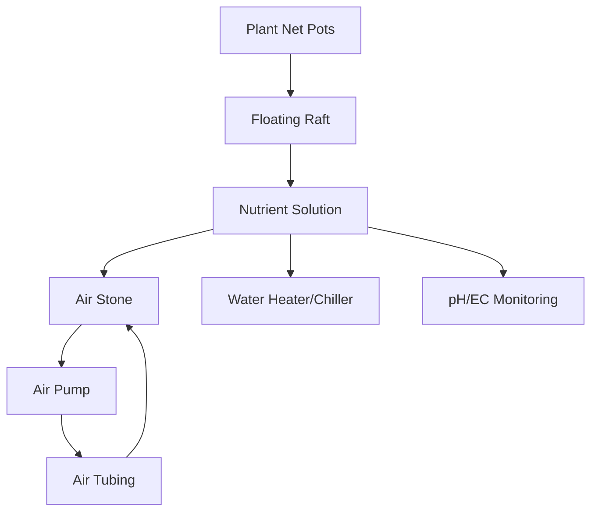
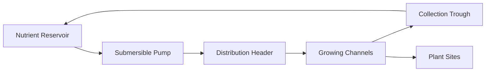

# Core Growing Systems: Aeroponics vs Hydroponics
## Technical Documentation for Implementation

---

## Table of Contents
1. [Executive Summary](#executive-summary)
2. [System Overview](#system-overview)
3. [Aeroponics Systems](#aeroponics-systems)
4. [Hydroponics Systems](#hydroponics-systems)
5. [Technical Comparison Matrix](#technical-comparison-matrix)
6. [Implementation Considerations](#implementation-considerations)
7. [Technical Specifications](#technical-specifications)
8. [Vendor & Component Guide](#vendor--component-guide)

---

## Executive Summary

This document provides a comprehensive technical analysis of core growing systems for soilless agriculture, specifically comparing aeroponics and hydroponics technologies. The analysis covers system architecture, component specifications, implementation costs, and scalability considerations to inform strategic decisions for a commercial farming.

**Key Findings:**
- **Hydroponics**: Lower initial investment, simpler maintenance, proven reliability
- **Aeroponics**: Higher efficiency, faster growth rates, premium market positioning
- **Hybrid Approach**: Recommended for maximum market flexibility and risk mitigation

---

## System Overview

### Fundamental Concepts

**Soilless Agriculture** employs nutrient-rich water solutions to deliver essential minerals directly to plant roots, eliminating the need for traditional soil-based growing media.

**Core Advantages:**
- 90% less water usage compared to soil farming
- Faster growth rates (25-50% improvement)
- Higher yields per square foot (3-10x increase)
- Year-round production capability
- Precise nutrient control
- Reduced pesticide requirements

### Technology Categories

---

## Aeroponics Systems

### System Definition
Aeroponics suspends plant roots in air while delivering nutrients through fine mist sprays, maximizing oxygen exposure and nutrient absorption efficiency.

### Core Components

#### 1. Root Chamber Systems
**Specifications:**
- Material: Food-grade ABS plastic or stainless steel
- Light-proof construction to prevent algae growth
- Drainage system with 2-5° slope for runoff collection
- Access ports for maintenance and inspection

**Technical Requirements:**
- Chamber volume: 2-4 cubic feet per plant (leafy greens)
- Interior surface: Non-toxic, smooth finish
- Ventilation: Passive air exchange ports
- Insulation: R-value 10-15 for temperature stability

#### 2. High-Pressure Misting Systems
**Core Specifications:**
- **Pressure Requirements**: 60-100 PSI (optimal: 80 PSI)
- **Droplet Size**: 50-100 microns for optimal absorption
- **Mist Duration**: 5-30 seconds every 2-5 minutes
- **Coverage**: 360° spray pattern for complete root coverage

**Component Details:**
- **Pumps**: Diaphragm pumps (1/2 to 2 HP depending on scale)
- **Nozzles**: Brass or stainless steel, anti-clog design
- **Filters**: 200-mesh inline filters to prevent clogging
- **Pressure Tanks**: 5-20 gallon capacity with pressure switches

#### 3. Low-Pressure Alternative Systems
**Specifications:**
- **Pressure Range**: 15-40 PSI
- **Droplet Size**: 100-300 microns
- **Lower complexity and maintenance requirements**
- **Reduced initial capital costs (30-40% less than high-pressure)**

### Aeroponics System Types

#### High-Pressure Aeroponics (HPA)

**Advantages:**
- Maximum nutrient uptake efficiency
- Fastest growth rates (30-50% faster than hydroponics)
- Minimal water usage
- Superior root oxygenation

**Challenges:**
- High initial investment ($15,000-50,000 per system)
- Complex maintenance requirements
- Sensitive to pump failures (4-hour backup requirement)
- Requires skilled technical staff

#### Low-Pressure Aeroponics (LPA)
**Advantages:**
- Lower equipment costs (50-60% of HPA costs)
- Simpler maintenance procedures
- More forgiving system tolerances
- Suitable for beginner operations

**Trade-offs:**
- 15-20% slower growth than HPA
- Higher water consumption than HPA
- Less precise nutrient delivery

### Fogponics Systems
**Ultra-Fine Mist Technology:**
- **Droplet Size**: 1-10 microns
- **Generation Method**: Ultrasonic transducers (1.7 MHz frequency)
- **Power Requirements**: 20-50 watts per transducer
- **Coverage Area**: 4-16 square feet per unit

---

## Hydroponics Systems

### System Definition
Hydroponics uses water-based nutrient solutions to feed plants, with roots either submerged in or regularly exposed to the nutrient solution.

### Primary System Types

#### 1. Deep Water Culture (DWC)

**Technical Specifications:**
- **Reservoir Depth**: 8-12 inches minimum
- **Solution Temperature**: 65-75°F optimal
- **Dissolved Oxygen**: 5-8 ppm minimum
- **Air Flow Rate**: 1-2 CFM per gallon of solution

**Component Requirements:**
- **Air Pumps**: 0.5-2 CFM output, oil-free diaphragm pumps
- **Air Stones**: Ceramic or glass, 4-12 inch lengths
- **Rafts**: Food-grade expanded polystyrene, 1-2 inch thickness
- **Net Pots**: 2-6 inch diameter, depending on crop type

#### 2. Nutrient Film Technique (NFT)

**System Specifications:**
- **Channel Slope**: 1:30 to 1:40 ratio
- **Film Depth**: 1-3mm nutrient film
- **Flow Rate**: 1-2 liters per minute per channel
- **Channel Material**: Food-grade PVC or NFT-specific profiles

**Design Parameters:**
- **Channel Width**: 4-8 inches for optimal root space
- **Plant Spacing**: 4-12 inches depending on crop
- **Maximum Run Length**: 30-40 feet to maintain nutrient levels
- **Pump Sizing**: 1/4 to 1/2 HP for most commercial installations

#### 3. Ebb and Flow (Flood and Drain)
**System Operation:**
- **Flood Cycle**: 15-30 minutes, 2-8 times daily
- **Drain Time**: 5-15 minutes for complete drainage
- **Growing Medium**: Clay pebbles, rockwool, or perlite

**Technical Components:**
- **Flood Tables**: 6-8 inches deep, with drainage fittings
- **Reservoirs**: 1:4 to 1:6 ratio to flood table volume
- **Pumps**: Submersible, 300-1200 GPH depending on table size
- **Timers**: Digital with multiple daily cycles

#### 4. Drip Systems
**System Categories:**
- **Recovery Systems**: Collect and reuse runoff (90-95% efficiency)
- **Non-Recovery**: Single-pass systems (simpler, higher waste)

**Component Specifications:**
- **Pressure Compensating Emitters**: 0.5-4 GPH flow rates
- **Distribution Lines**: 1/4 to 1/2 inch tubing
- **Filters**: 120-200 mesh inline filtration
- **Pressure Regulation**: 10-25 PSI operating pressure

---

## Technical Comparison Matrix

### Performance Metrics

| Metric | Aeroponics (HPA) | Aeroponics (LPA) | DWC | NFT | Ebb & Flow | Drip Systems |
|--------|------------------|------------------|-----|-----|------------|--------------|
| **Growth Rate** | 100% (baseline) | 85% | 75% | 80% | 70% | 65% |
| **Water Efficiency** | 95% | 90% | 70% | 85% | 75% | 60-90% |
| **Setup Complexity** | Very High | High | Low | Medium | Medium | Low |
| **Maintenance** | High | Medium | Low | Medium | Low | Low |
| **Capital Cost/sq ft** | $50-80 | $30-50 | $15-25 | $20-35 | $15-30 | $10-25 |
| **Power Consumption** | High | Medium | Low | Medium | Low | Low |
| **Crop Suitability** | All crops | All crops | Leafy greens | Leafy/herbs | Most crops | All crops |
| **Failure Risk** | High | Medium | Low | Medium | Low | Low |
| **Scalability** | Complex | Medium | Easy | Medium | Easy | Very Easy |

### Operational Requirements

| Factor | Aeroponics | Hydroponics |
|--------|------------|-------------|
| **Technical Skill Level** | Advanced | Beginner-Intermediate |
| **Monitoring Frequency** | Hourly during operation | Daily |
| **Backup Systems Required** | Critical (4-hour max downtime) | Recommended |
| **Automation Necessity** | Essential | Beneficial |
| **Staff Training Time** | 40-80 hours | 8-20 hours |

---

## Implementation Considerations

### System Selection Criteria

#### Choose Aeroponics When:
- **Premium Market Focus**: Targeting high-value, organic, or specialty crops
- **Maximum Efficiency Required**: Water and space are severely limited
- **Technical Expertise Available**: Skilled staff and maintenance capabilities
- **Higher ROI Acceptable**: Can absorb higher initial costs for faster returns
- **Research/Development Focus**: Innovation and optimization are key goals

#### Choose Hydroponics When:
- **Reliability is Critical**: Consistent production without technical failures
- **Lower Initial Investment**: Limited capital available
- **Beginner Operation**: First-time soilless farming venture
- **Mass Production Focus**: Large-scale, cost-effective production
- **Proven Market Approach**: Established customer base and distribution

### Risk Assessment

#### Aeroponics Risk Factors:
1. **Equipment Failure**: Nozzle clogging, pump failure, timer malfunction
2. **Technical Complexity**: Requires specialized knowledge for troubleshooting
3. **Higher Operating Costs**: Energy, maintenance, replacement parts
4. **Learning Curve**: 6-12 months to achieve optimal performance

#### Hydroponics Risk Factors:
1. **Disease Spread**: Waterborne pathogens can affect entire system
2. **Slower Adaptation**: Less responsive to market demands for specialty crops
3. **Space Efficiency**: Lower yield per square foot compared to aeroponics

### Infrastructure Requirements

#### Aeroponics Infrastructure:
- **Power Requirements**: 5-10 KW per 1000 sq ft
- **Backup Power**: UPS or generator with automatic switchover
- **Environmental Control**: Precise humidity control (50-70% RH)
- **Technical Support**: On-call technician within 2-hour response time

#### Hydroponics Infrastructure:
- **Power Requirements**: 3-6 KW per 1000 sq ft
- **Environmental Tolerance**: More forgiving of fluctuations
- **Maintenance Access**: Standard plumbing and electrical skills sufficient

---

## Technical Specifications

### Component Specifications Reference

#### Aeroponics Components

**High-Pressure Pumps:**
- **Recommended Models**: Aquatec 8800 Series, Cat Pumps 3DX Series
- **Specifications**: 60-100 PSI, 0.5-2 GPM flow rate
- **Maintenance**: Diaphragm replacement every 1000-2000 hours
- **Cost Range**: $200-800 per pump

**Misting Nozzles:**
- **Materials**: Brass (economy), Stainless Steel (premium)
- **Orifice Sizes**: 0.1-0.4mm for optimal droplet size
- **Spray Patterns**: 360°, 180°, 90° depending on application
- **Replacement Schedule**: Every 3-6 months depending on water quality

**Pressure Tanks:**
- **Capacity**: 1-20 gallons based on system size
- **Pressure Rating**: 125-150 PSI working pressure
- **Materials**: Stainless steel or composite construction
- **Features**: Pressure gauge, relief valve, drain valve

#### Hydroponics Components

**Water Pumps:**
- **Submersible Pumps**: Eco Plus, Active Aqua brands
- **Flow Rates**: 185-1200 GPH depending on system size
- **Head Pressure**: 6-12 feet typical requirement
- **Energy Efficiency**: Look for Energy Star ratings

**Air Pumps and Stones:**
- **Pump Capacity**: 1-2 CFM per 10 gallons of nutrient solution
- **Air Stone Types**: Ceramic (fine bubbles), Glass (durability)
- **Tubing**: Food-grade silicone, 4-6mm diameter
- **Maintenance**: Clean stones monthly, replace every 6 months

### Environmental Control Integration

#### Temperature Management:
- **Water Chillers**: 1/10 HP per 100 gallons (rough sizing)
- **Heaters**: Titanium or stainless steel heating elements
- **Insulation**: Closed-cell foam for reservoir insulation
- **Control Range**: ±2°F precision for optimal root health

#### Monitoring Systems:
- **pH Sensors**: Electrode or ISFET technology, ±0.1 pH accuracy
- **EC Meters**: Conductivity range 0-5000 μS/cm
- **Data Logging**: Cloud-connected sensors with mobile alerts
- **Calibration**: Monthly for pH, quarterly for EC sensors

---