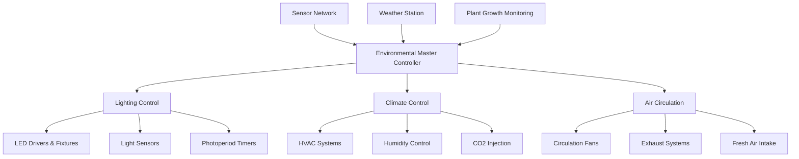
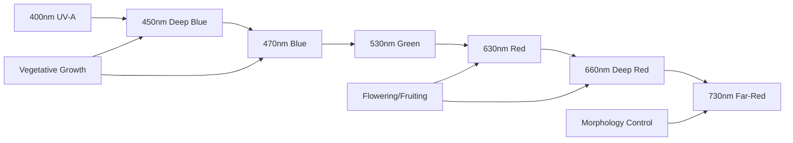
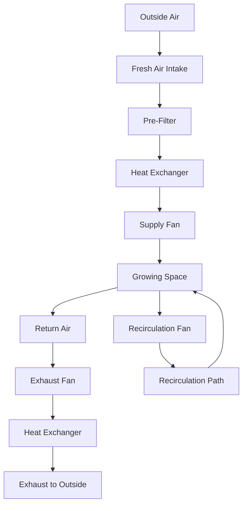

# Environmental Control Systems: Lighting, Climate & Air Circulation
## Technical Documentation for Implementation

---

## Table of Contents
1. [Executive Summary](#executive-summary)
2. [System Overview](#system-overview)
3. [LED Lighting Systems](#led-lighting-systems)
4. [Climate Control Systems](#climate-control-systems)
5. [Air Circulation & Ventilation](#air-circulation--ventilation)
6. [Integration & Automation](#integration--automation)
7. [Performance Optimization](#performance-optimization)
8. [Technical Specifications](#technical-specifications)
9. [Implementation Guide](#implementation-guide)
10. [Maintenance & Operations](#maintenance--operations)

---

## Executive Summary

Environmental control systems are the foundation of successful soilless agriculture operations. This document provides comprehensive technical guidance for designing, implementing, and optimizing lighting, climate, and air circulation systems that maximize plant growth while minimizing energy consumption and operational costs.

**Key Control Systems:**
- **LED Lighting**: Full-spectrum, programmable systems with 40-60% energy savings
- **Climate Control**: Precise temperature and humidity management (±1°F, ±5% RH)
- **Air Circulation**: Optimized airflow for CO2 distribution and disease prevention
- **Automation**: Integrated control systems with environmental feedback loops

**Critical Success Factors:**
- Energy efficiency optimization can reduce operating costs by 30-50%
- Proper environmental control increases yields by 20-40%
- Automation reduces labor costs by 60-80%
- Integrated systems provide 15-25% better ROI than standalone components

---

## System Overview

### Environmental Control Hierarchy



### Fundamental Requirements

**Environmental Ranges for Optimal Growth:**
- **Temperature**: 65-75°F (18-24°C) for most leafy greens
- **Humidity**: 50-70% RH during vegetative growth
- **Light Intensity**: 200-400 μmol/m²/s PPFD for leafy greens
- **Photoperiod**: 14-18 hours daily light cycle
- **CO2 Concentration**: 800-1200 ppm (ambient: 400 ppm)
- **Air Movement**: 0.1-0.5 m/s gentle circulation

### System Integration Benefits

**Coordinated Control Advantages:**
- Energy optimization through intelligent scheduling
- Automatic compensation between systems
- Predictive adjustments based on growth cycles
- Reduced manual intervention and labor costs
- Consistent environmental conditions regardless of external weather

---

## LED Lighting Systems

### LED Technology Overview

**LED Advantages for Indoor Agriculture:**
- **Energy Efficiency**: 2.5-3.0 μmol/J efficacy vs 1.7 μmol/J for HPS
- **Heat Management**: 50-60% less heat generation than traditional lighting
- **Spectrum Control**: Precise wavelength targeting for plant responses
- **Longevity**: 50,000+ hour lifespan vs 10,000 hours for HPS
- **Instant Control**: Immediate on/off and dimming capabilities

### Light Spectrum Requirements

#### Photosynthetically Active Radiation (PAR)
**Wavelength Range**: 400-700 nanometers

**Critical Wavelengths:**
- **Blue (400-500nm)**: Vegetative growth, compact plant structure
- **Green (500-600nm)**: Canopy penetration, overall plant health
- **Red (600-700nm)**: Flowering, fruiting, biomass accumulation
- **Far-Red (700-800nm)**: Stem elongation, flowering triggers



#### Spectrum Recipes for Different Growth Phases

**Seedling Stage (0-2 weeks):**
- Blue: 40-50%
- Red: 40-50%
- Green: 5-10%
- PPFD: 100-200 μmol/m²/s
- Photoperiod: 16-18 hours

**Vegetative Growth (2-6 weeks):**
- Blue: 30-40%
- Red: 50-60%
- Green: 5-15%
- PPFD: 200-350 μmol/m²/s
- Photoperiod: 14-16 hours

**Harvest Preparation (Final 1-2 weeks):**
- Blue: 20-30%
- Red: 60-70%
- Green: 5-10%
- Far-Red: 3-5% (optional)
- PPFD: 250-400 μmol/m²/s

### LED System Components

#### 1. LED Fixtures and Arrays
**Form Factors:**
- **Linear Bars**: Best for shelving systems and uniform coverage
- **Panel Fixtures**: High-intensity applications, single-level growing
- **Strip Lights**: Flexible installation, side lighting applications

**Technical Specifications:**
- **Efficacy**: Target 2.7-3.0 μmol/J for premium systems
- **Power Density**: 25-45 watts per square foot depending on crop
- **Beam Angle**: 60-120 degrees for optimal uniformity
- **IP Rating**: IP65 minimum for humid environments

#### 2. LED Drivers and Power Supplies
**Driver Types:**
- **Constant Current (CC)**: Precise control, better for dimming
- **Constant Voltage (CV)**: Simpler installation, lower cost

**Key Features:**
- **Dimming Capability**: 0-10V, PWM, or DALI protocols
- **Power Factor**: >0.95 for energy efficiency
- **THD**: <20% total harmonic distortion
- **Efficiency**: >94% driver efficiency rating

#### 3. Control and Monitoring Systems
**Control Protocols:**
- **0-10V Dimming**: Simple analog control
- **DALI**: Digital addressable lighting interface
- **DMX512**: Professional lighting control protocol
- **Wireless**: Zigbee or WiFi-based systems

**Monitoring Capabilities:**
- **Light Sensors**: PAR meters for feedback control
- **Spectrum Analysis**: Real-time spectral monitoring
- **Energy Monitoring**: Power consumption tracking
- **Temperature Monitoring**: LED junction temperature

### Heat Management for LED Systems

#### Thermal Design Considerations
**Heat Dissipation Requirements:**
- **Heat Sink Design**: Aluminum extrusions with fins
- **Thermal Interface**: Thermal pads or compounds
- **Airflow Design**: Passive or active cooling systems
- **Junction Temperature**: Keep below 85°C for longevity

**Cooling System Options:**
1. **Passive Cooling**: Heat sinks with natural convection
2. **Active Air Cooling**: Heat sinks with fans
3. **Liquid Cooling**: For high-intensity applications
4. **Integrated HVAC**: Heat recovery for facility heating

---

## Climate Control Systems

### Temperature Control Systems

#### Heating Systems
**Electric Heating Options:**
- **Radiant Heaters**: Infrared panels for targeted heating
- **Forced Air Heaters**: Fan-forced electric heaters
- **Heat Pumps**: Energy-efficient heating and cooling
- **Radiant Floor Systems**: Even heat distribution

**Alternative Heating:**
- **Natural Gas**: Lower operating costs in cold climates
- **Geothermal**: High efficiency, stable temperatures
- **Waste Heat Recovery**: From LED fixtures and equipment

**Sizing Calculations:**
```
Heating Load (BTU/hr) = Space Volume × Temperature Differential × Heat Loss Factor
Heat Loss Factor: 
- Well-insulated: 1.5-2.0
- Standard: 2.0-3.0
- Poor insulation: 3.0-4.0
```

#### Cooling Systems
**Air Conditioning Options:**
- **Split Systems**: 1-5 ton capacity for smaller spaces
- **Package Units**: 5-25 ton capacity for larger facilities
- **Chilled Water Systems**: Central cooling for large operations
- **Evaporative Cooling**: Energy-efficient in dry climates

**Heat Pump Systems:**
- **Air-Source Heat Pumps**: Standard efficiency and cost
- **Water-Source Heat Pumps**: Higher efficiency, requires water loop
- **Geothermal Heat Pumps**: Highest efficiency, higher installation cost

**Cooling Load Calculations:**
```
Cooling Load Components:
├── Sensible Heat Load
│   ├── Lighting: Watts × 3.412 BTU/W
│   ├── Equipment: Pumps, fans, electronics
│   ├── Solar Gain: Windows, roof exposure
│   └── Infiltration: Outside air leakage
└── Latent Heat Load
    ├── Plant Transpiration: 0.5-2.0 BTU/hr/sq ft
    ├── Irrigation Evaporation: Variable
    └── Human Occupancy: 200-400 BTU/hr/person
```

### Humidity Control Systems

#### Dehumidification
**Dehumidification Methods:**
- **Refrigerant Dehumidifiers**: Most common, 50-150 pints/day
- **Desiccant Dehumidifiers**: Better for low-temperature applications
- **Ventilation Dehumidification**: Dilution with dry outside air
- **Condensing Units**: Integrated with cooling systems

**Sizing Requirements:**
```
Dehumidification Load = Plant Transpiration + Irrigation Evaporation + Infiltration
Typical Values:
- Lettuce: 0.5-1.0 gallons/day/1000 sq ft
- Herbs: 1.0-2.0 gallons/day/1000 sq ft
- Tomatoes: 2.0-4.0 gallons/day/1000 sq ft
```

#### Humidification
**Humidification Methods:**
- **Ultrasonic Humidifiers**: Fine mist, low energy consumption
- **Evaporative Pads**: Natural evaporation, lower cost
- **Steam Injection**: Precise control, higher energy use
- **Misting Systems**: Dual-purpose cooling and humidification

### CO2 Enhancement Systems

#### CO2 Sources and Generation
**CO2 Supply Options:**
- **Compressed CO2 Tanks**: Clean, precise control, higher cost
- **Liquid CO2**: Bulk storage, lower cost per pound
- **CO2 Generators**: Burn propane or natural gas, produces heat
- **Fermentation Systems**: Organic CO2 production, variable output

#### Distribution Systems
**Delivery Methods:**
- **Perforated Tubing**: Distributed CO2 release
- **Injection into Air Handlers**: Mixed with circulated air
- **Direct Release**: Point sources with circulation fans
- **Venturi Systems**: Injected into irrigation water

**Control Strategies:**
- **PPM Control**: Maintain 800-1200 ppm during light hours
- **Timer-Based**: Coordinated with photoperiod
- **Sensor Feedback**: Real-time monitoring and adjustment
- **Zone Control**: Different concentrations for different growth stages

---

## Air Circulation & Ventilation

### Air Movement Requirements

#### Circulation Benefits
**Plant Health:**
- **Transpiration Control**: Prevents leaf moisture buildup
- **CO2 Distribution**: Ensures uniform CO2 availability
- **Temperature Uniformity**: Eliminates hot and cold spots
- **Disease Prevention**: Reduces fungal and bacterial growth

**System Performance:**
- **Heat Distribution**: Even temperature throughout space
- **Humidity Control**: Prevents moisture stratification
- **Air Quality**: Dilutes harmful gases and odors

### Fan Systems and Specifications

#### Circulation Fans
**Fan Types:**
- **Ceiling Fans**: Large diameter, low speed, high volume
- **Wall-Mounted Fans**: Directional airflow, adjustable
- **Pedestal Fans**: Portable, oscillating options
- **In-line Fans**: Duct-mounted for forced distribution

**Sizing Guidelines:**
```
Air Changes Per Hour (ACH) Requirements:
- Minimum: 0.5-1.0 ACH for basic circulation
- Standard: 1.0-2.0 ACH for good mixing
- High-intensity: 2.0-4.0 ACH for problem areas

CFM Calculation:
CFM = (Room Volume × ACH) / 60 minutes
```

**Performance Specifications:**
- **Velocity**: 0.1-0.5 m/s at plant level
- **Noise Level**: <50 dB for worker comfort
- **Energy Efficiency**: High-efficiency motors (IE3 or better)
- **Variable Speed**: VFD capability for optimization

#### Exhaust and Fresh Air Systems
**Exhaust Requirements:**
- **Heat Removal**: During peak cooling loads
- **Humidity Control**: Remove excess moisture
- **Air Quality**: Remove CO2 buildup during dark periods
- **Odor Control**: Carbon filtration for urban locations

**Fresh Air Intake:**
- **Minimum Rate**: 0.1-0.2 ACH for air quality
- **Filtration**: HEPA or MERV 13-16 filters
- **Pre-conditioning**: Heating or cooling as needed
- **Damper Control**: Modulating intake based on conditions

### Ventilation Control Strategies

#### Natural Ventilation
**Passive Ventilation Methods:**
- **Ridge and Soffit Vents**: Stack effect ventilation
- **Sidewall Louvers**: Cross-ventilation patterns
- **Roof Vents**: Heat-driven exhaust

**Limitations:**
- Weather-dependent performance
- Limited control precision
- Seasonal effectiveness variations

#### Mechanical Ventilation
**Forced Ventilation Systems:**
- **Supply and Exhaust Fans**: Balanced air exchange
- **Variable Speed Control**: Energy-efficient operation
- **Damper Systems**: Automated air flow control
- **Heat Recovery**: Energy recovery ventilators (ERV)



---

## Integration & Automation

### Control System Architecture

#### Central Control Platform
**System Components:**
- **Master Controller**: Industrial PLC or specialized grow controller
- **HMI Interface**: Touch screen or computer-based interface
- **Sensor Network**: Distributed monitoring points
- **Communication Protocol**: Modbus, BACnet, or proprietary systems

**Integration Capabilities:**
- **Climate Control**: HVAC, humidity, CO2 coordination
- **Lighting Control**: Spectrum, intensity, photoperiod management
- **Irrigation**: Coordinated with environmental conditions
- **Security Systems**: Access control and monitoring integration

### Environmental Sensors and Monitoring

#### Sensor Types and Specifications
**Temperature Sensors:**
- **Accuracy**: ±0.5°F for critical applications
- **Response Time**: <30 seconds for control feedback
- **Calibration**: Annual calibration recommended
- **Redundancy**: Multiple sensors for reliability

**Humidity Sensors:**
- **Range**: 0-100% RH measurement capability
- **Accuracy**: ±2% RH for control applications
- **Stability**: <1% drift per year
- **Compensation**: Temperature compensation built-in

**Light Sensors:**
- **PAR Sensors**: Quantum sensors for PPFD measurement
- **Spectral Sensors**: Multi-channel for spectrum analysis
- **Calibration**: Traceable standards annually
- **Placement**: Representative locations throughout facility

**CO2 Sensors:**
- **NDIR Technology**: Non-dispersive infrared for accuracy
- **Range**: 0-5000 ppm measurement range
- **Accuracy**: ±50 ppm or ±3% of reading
- **Maintenance**: Calibration every 6-12 months

### Automation Strategies

#### Programmed Control Sequences
**Daily Light Cycles:**
```
Sunrise Simulation:
├── 05:00 - 0% intensity, full spectrum
├── 05:30 - 10% intensity, blue-heavy spectrum
├── 06:00 - 25% intensity, balanced spectrum
├── 06:30 - 50% intensity, balanced spectrum
└── 07:00 - 100% intensity, optimized spectrum

Sunset Simulation:
├── 19:00 - 100% intensity, red-heavy spectrum
├── 19:30 - 75% intensity, red-heavy spectrum
├── 20:00 - 50% intensity, red spectrum
├── 20:30 - 25% intensity, red spectrum
└── 21:00 - 0% intensity, lights off
```

**Climate Response Programs:**
- **Temperature Compensation**: Automatic heating/cooling adjustments
- **Humidity Control**: Coordinated dehumidification/humidification
- **Ventilation Scheduling**: Fresh air intake based on occupancy and growth stage
- **Energy Management**: Load shedding during peak demand periods

#### Smart Control Features
**Adaptive Control:**
- **Machine Learning**: Pattern recognition for optimization
- **Weather Compensation**: Adjustments based on external conditions
- **Growth Stage Recognition**: Automatic environmental adjustments
- **Energy Optimization**: Intelligent scheduling for lowest energy costs

**Remote Monitoring:**
- **Mobile Apps**: Real-time monitoring and alerts
- **Cloud Connectivity**: Data logging and analysis
- **Alarm Systems**: SMS, email, and push notifications
- **Historical Trending**: Performance analysis and optimization

---

## Performance Optimization

### Energy Efficiency Strategies

#### LED Lighting Optimization
**Efficiency Measures:**
- **Light Mapping**: Uniform PPFD distribution analysis
- **Spectrum Optimization**: Match spectrum to growth requirements
- **Dimming Strategies**: Reduce intensity during low-demand periods
- **Fixture Selection**: High-efficacy fixtures (>2.7 μmol/J)

**Energy Savings Calculations:**
```
Annual Energy Savings = (Baseline kWh - Optimized kWh) × Electricity Rate
Example:
Baseline HPS: 1000W × 16 hours × 365 days = 5,840 kWh
Optimized LED: 600W × 16 hours × 365 days = 3,504 kWh
Savings: 2,336 kWh × $0.12/kWh = $280/year per fixture
```

#### HVAC Optimization
**Efficiency Improvements:**
- **Variable Speed Drives**: 20-30% energy savings on fans and pumps
- **Heat Recovery**: Capture waste heat from LED fixtures
- **Smart Thermostats**: Precise temperature control reduces energy waste
- **Zoning Systems**: Independent control of different growing areas

### Yield Enhancement Strategies

#### Light Level Optimization
**PPFD Recommendations by Growth Stage:**
```
Seedlings (Days 0-7): 100-150 μmol/m²/s
Young Plants (Days 8-21): 150-250 μmol/m²/s
Mature Growth (Days 22-harvest): 250-400 μmol/m²/s

Daily Light Integral (DLI):
Lettuce: 14-18 mol/m²/day
Basil: 16-22 mol/m²/day
Kale: 18-24 mol/m²/day
```

#### Climate Optimization
**Growth-Stage-Specific Environments:**
- **Germination**: 75-80°F, 80-85% RH, minimal air movement
- **Vegetative**: 70-75°F, 60-70% RH, gentle air circulation
- **Maturation**: 68-72°F, 50-60% RH, increased air movement

---

## Technical Specifications

### LED Lighting Technical Details

#### Professional-Grade LED Specifications
**High-Performance LED Arrays:**
- **Chip Technology**: Samsung LM301H or equivalent efficiency
- **Efficacy**: 2.8-3.0 μmol/J system efficacy
- **Spectrum**: Full spectrum with adjustable ratios
- **Lifetime**: L90 > 50,000 hours
- **Warranty**: Minimum 5-year full replacement warranty

**Driver Specifications:**
- **Input Voltage**: 120-277VAC or 347-480VAC
- **Power Factor**: >0.95 at full load
- **THD**: <10% total harmonic distortion
- **Efficiency**: >95% driver efficiency
- **Dimming**: Smooth dimming from 0-100%

#### Control and Monitoring
**Lighting Control Protocols:**
- **DALI-2**: Digital addressable lighting interface
- **0-10V**: Analog dimming control
- **DMX512**: Professional lighting control
- **Ethernet**: IP-based control and monitoring

### HVAC System Specifications

#### Commercial HVAC Equipment
**Air Handling Units:**
- **Capacity Range**: 2,000-50,000 CFM
- **Efficiency**: EER 11.0+ for cooling, HSPF 8.0+ for heating
- **Controls**: BACnet or Modbus communication
- **Filtration**: MERV 8-13 pre-filters, HEPA option

**Heat Pumps:**
- **SEER Rating**: 16+ for air-source units
- **COP**: 3.5+ coefficient of performance
- **Operating Range**: -10°F to 115°F for air-source
- **Modulation**: Variable capacity operation

#### Dehumidification Equipment
**Commercial Dehumidifiers:**
- **Capacity**: 50-1000 pints/day removal
- **Energy Factor**: 1.8+ liters/kWh efficiency
- **Controls**: Humidity sensor feedback
- **Drainage**: Continuous drain and pump options

### Sensor and Control Specifications

#### Environmental Sensors
**Temperature/Humidity Sensors:**
- **Accuracy**: ±0.1°C, ±1% RH
- **Response Time**: T90 < 30 seconds
- **Operating Range**: -40°C to +125°C, 0-100% RH
- **Communication**: 4-20mA, Modbus, or digital protocols

**CO2 Sensors:**
- **Technology**: NDIR (non-dispersive infrared)
- **Range**: 0-2000 ppm standard, 0-5000 ppm optional
- **Accuracy**: ±30 ppm ±3% of reading
- **Drift**: <2% per year maximum

**Light Sensors:**
- **Measurement**: PPFD in μmol/m²/s
- **Range**: 0-2000 μmol/m²/s
- **Accuracy**: ±5% under LED lighting
- **Response**: Cosine-corrected for accurate readings

---

## Implementation Guide

### Design Phase Considerations

#### Load Calculations and Sizing
**Electrical Load Assessment:**
```
Lighting Load = Area (sq ft) × Power Density (W/sq ft)
Power Densities:
- LED Full-Spectrum: 25-45 W/sq ft
- Supplemental LED: 15-25 W/sq ft

HVAC Load = Sensible Load + Latent Load
Sensible: Lighting heat + equipment heat + solar gain
Latent: Plant transpiration + irrigation evaporation
```

**System Sizing Guidelines:**
- **Cooling**: 1 ton per 400 sq ft (high-intensity lighting)
- **Heating**: 50-100 BTU/hr per sq ft in cold climates
- **Dehumidification**: 1 pint/hr per 50 sq ft growing area
- **Air Circulation**: 1-2 air changes per hour minimum

#### Infrastructure Requirements
**Electrical Infrastructure:**
- **Service Entrance**: Calculate total connected load + 25% safety factor
- **Panel Distribution**: Separate panels for lighting, HVAC, controls
- **Emergency Power**: Generator sizing for critical loads
- **Power Quality**: Surge protection, power factor correction

**Structural Requirements:**
- **LED Mounting**: 50-100 lbs per fixture including mounting
- **HVAC Equipment**: Roof or floor-mounted unit considerations
- **Ductwork**: Supply and return air distribution
- **Controls**: Low-voltage wiring for sensors and communication

### Installation Best Practices

#### LED Installation Guidelines
**Mounting Considerations:**
- **Height**: 12-24 inches above canopy for leafy greens
- **Spacing**: 1:1 to 1.5:1 spacing-to-mounting-height ratio
- **Orientation**: Parallel to growing rows for uniformity
- **Adjustment**: Height-adjustable mounting for different crops

**Electrical Installation:**
- **Circuit Protection**: Individual circuit breakers per fixture
- **Grounding**: Proper equipment grounding for safety
- **Dimming Wires**: Separate low-voltage dimming circuits
- **Heat Management**: Adequate spacing for heat dissipation

#### HVAC Installation
**Ductwork Design:**
- **Supply Air**: Low-velocity distribution (500-800 FPM)
- **Return Air**: Central return with adequate capacity
- **Insulation**: R-6 minimum for supply ducts
- **Sealing**: All ductwork sealed to prevent leakage

**Equipment Placement:**
- **Outdoor Units**: Adequate clearance and maintenance access
- **Indoor Units**: Minimize noise transmission to growing areas
- **Piping**: Properly sized refrigerant lines with insulation
- **Drainage**: Condensate removal with backup options

### Commissioning and Testing

#### Performance Verification
**Lighting Verification:**
- **PPFD Mapping**: Measure light levels at plant height
- **Spectrum Analysis**: Verify wavelength output
- **Dimming Testing**: Confirm smooth dimming operation
- **Energy Measurement**: Verify actual power consumption

**HVAC Commissioning:**
- **Airflow Testing**: Measure supply and return air quantities
- **Temperature Control**: Verify setpoint accuracy
- **Humidity Control**: Test dehumidification capacity
- **Controls Integration**: Verify all automatic functions

---


## Maintenance & Operations

### Preventive Maintenance Schedules

#### LED System Maintenance
**Monthly Tasks:**
- Visual inspection of fixtures for damage or discoloration
- Clean fixture lenses and heat sinks
- Check mounting hardware tightness
- Verify dimming and spectrum control functions

**Quarterly Tasks:**
- Measure PPFD levels and document any decline
- Inspect electrical connections and wiring
- Clean driver enclosures and check for proper ventilation
- Update control software and firmware

**Annual Tasks:**
- Professional PPFD mapping and uniformity analysis
- Spectral analysis to verify wavelength output
- Driver performance testing and efficiency measurement
- LED chip degradation assessment and replacement planning

#### HVAC System Maintenance
**Monthly Tasks:**
- Change air filters (or as needed based on pressure differential)
- Inspect and clean condenser coils
- Check refrigerant levels and look for leaks
- Verify temperature and humidity control accuracy

**Quarterly Tasks:**
- Lubricate fan motors and check belt tension
- Inspect ductwork for leaks and secure connections
- Clean evaporator coils and drain pans
- Test safety controls and alarms

**Annual Tasks:**
- Professional system tune-up and efficiency testing
- Refrigerant system leak testing and charging
- Control system calibration and programming updates
- Heat exchanger cleaning and inspection

#### Sensor and Control Maintenance
**Weekly Tasks:**
- Review data logs for unusual patterns or alarms
- Check sensor readings against reference standards
- Verify communication between sensors and controllers

**Monthly Tasks:**
- Clean sensor housings and protective covers
- Check calibration of critical sensors (CO2, pH)
- Test alarm systems and notification functions

**Annual Tasks:**
- Professional sensor calibration with traceable standards
- Control system backup and software updates
- Communication network testing and optimization
- Spare parts inventory review and replenishment

### Troubleshooting Guide

#### Common LED Issues
**Reduced Light Output:**
- **Cause**: LED degradation, driver failure, overheating
- **Diagnosis**: Measure PPFD and compare to baseline
- **Solution**: Replace degraded fixtures, improve ventilation

**Spectrum Drift:**
- **Cause**: Individual LED chip degradation rates vary
- **Diagnosis**: Spectral analysis reveals wavelength changes
- **Solution**: Fixture replacement or spectrum recalibration

**Dimming Problems:**
- **Cause**: Driver issues, control signal problems
- **Diagnosis**: Test dimming signals and driver response
- **Solution**: Replace drivers or repair control wiring

#### HVAC Troubleshooting
**Temperature Control Issues:**
- **High Temperature**: Check refrigerant levels, clean coils, verify airflow
- **Low Temperature**: Check heating elements, verify thermostat settings
- **Temperature Swings**: Calibrate sensors, check control algorithms

**Humidity Problems:**
- **High Humidity**: Verify dehumidifier operation, check air sealing
- **Low Humidity**: Check humidifier function, verify setpoints
- **Humidity Cycling**: Adjust control deadbands, improve air mixing

### Performance Optimization Strategies

#### Energy Efficiency Improvements
**Lighting Optimization:**
- Implement daylight harvesting where applicable
- Use occupancy sensors for non-critical areas
- Optimize spectrum for specific growth stages
- Schedule lighting based on time-of-use electricity rates

**HVAC Optimization:**
- Install economizers for free cooling when possible
- Use variable speed drives on all motors
- Implement heat recovery systems
- Optimize setpoints based on crop requirements

#### Yield Enhancement Techniques
**Environmental Precision:**
- Maintain tight temperature control (±1°F)
- Monitor and control vapor pressure deficit (VPD)
- Optimize CO2 levels for growth stage and light intensity
- Ensure uniform environmental conditions throughout growing area

**Data-Driven Optimization:**
- Track environmental conditions vs. yield data
- Use machine learning for predictive control
- Implement closed-loop optimization algorithms
- Regular performance benchmarking and analysis

---

## Conclusion

Environmental control systems represent the most critical investment in soilless agriculture operations, directly impacting both plant performance and operational efficiency. The integration of LED lighting, precision climate control, and intelligent automation creates the foundation for consistent, high-quality crop production.

**Implementation Priorities:**
1. **Start with reliable, proven technologies** to establish consistent production
2. **Invest in quality sensors and controls** for long-term optimization
3. **Plan for scalability** from the initial design phase
4. **Focus on energy efficiency** to minimize operating costs
5. **Implement data collection** for continuous improvement

**Success Factors:**
- Proper system sizing and integration from the start
- Comprehensive staff training on system operation
- Regular maintenance and calibration schedules
- Continuous monitoring and performance optimization
- Strategic upgrades based on proven ROI

The environmental control systems detailed in this document provide the technical foundation for achieving optimal plant growth while maintaining energy efficiency and operational reliability. Success depends on careful planning, quality installation, and ongoing optimization based on performance data.

---
