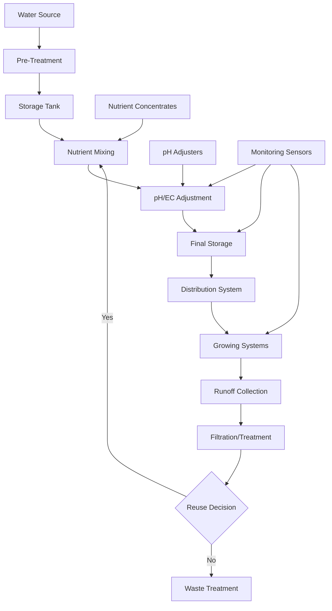
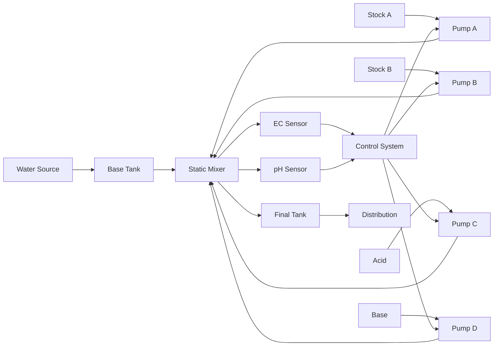

# Nutrient Delivery and Water Management Systems
## Technical Documentation for Implementation

---

## Table of Contents
1. [Executive Summary](#executive-summary)
2. [System Overview](#system-overview)
3. [Water Management Systems](#water-management-systems)
4. [Nutrient Delivery Systems](#nutrient-delivery-systems)
5. [Fertigation Systems](#fertigation-systems)
6. [Water Treatment and Quality Control](#water-treatment-and-quality-control)
7. [Storage and Distribution Infrastructure](#storage-and-distribution-infrastructure)
8. [Monitoring and Control Systems](#monitoring-and-control-systems)
9. [Automation and Scheduling](#automation-and-scheduling)
10. [Technical Specifications](#technical-specifications)
11. [Implementation and Optimization](#implementation-and-optimization)

---

## Executive Summary

Nutrient delivery and water management systems form the circulatory system of soilless agriculture operations. These systems must precisely deliver water, nutrients, and additives to plants while maintaining optimal water quality, minimizing waste, and ensuring system reliability. This document provides comprehensive technical guidance for designing, implementing, and optimizing these critical systems.

**Core System Functions:**
- **Water Management**: Supply, treatment, storage, and distribution of water
- **Nutrient Delivery**: Precise mixing and delivery of fertilizer solutions
- **Quality Control**: pH, EC, dissolved oxygen, and contamination management
- **Resource Conservation**: Recycling, recapture, and efficient utilization

**Key Performance Objectives:**
- **Precision**: ±0.1 pH units, ±5% EC tolerance for optimal plant nutrition
- **Efficiency**: 90-95% water utilization through recycling and recapture
- **Reliability**: 99.5%+ uptime for continuous crop production
- **Scalability**: Modular design supporting 500-50,000+ sq ft operations
- **Cost Effectiveness**: 20-30% reduction in water and nutrient costs through optimization

**Critical Benefits:**
- Precise nutrient control optimizes plant growth and yield quality
- Water recycling reduces consumption by 80-95% vs. traditional agriculture
- Automated systems reduce labor requirements by 60-70%
- Real-time monitoring prevents crop losses from nutrient imbalances
- Integrated systems support multiple growing methods and crop types

---

## System Overview

### Integrated Water and Nutrient Flow



### System Architecture Layers

**Physical Infrastructure:**
- Water intake, treatment, and storage systems
- Nutrient storage and injection equipment
- Pumps, valves, and distribution networks
- Collection and recycling infrastructure

**Control Systems:**
- Automated mixing and injection systems
- pH and EC control loops
- Flow and pressure management
- Safety interlocks and alarms

**Monitoring Network:**
- Water quality sensors throughout the system
- Flow, pressure, and level monitoring
- Nutrient concentration tracking
- System performance analytics

**Management Platform:**
- Recipe management and scheduling
- Inventory tracking and alerts
- Performance optimization algorithms
- Reporting and compliance tools

### System Design Principles

**Modularity:**
- Scalable components that grow with operation size
- Standardized connections and interfaces
- Independent zone control capabilities
- Plug-and-play sensor integration

**Redundancy:**
- Backup pumps and critical components
- Multiple monitoring points
- Emergency manual override capabilities
- Alternative water sources and pathways

**Efficiency:**
- Closed-loop recycling systems
- Demand-based delivery scheduling
- Energy-efficient pumping and treatment
- Minimal water and nutrient waste

---

## Water Management Systems

### Water Sources and Intake

#### Municipal Water Systems
**Advantages:**
- Consistent availability and pressure
- Pre-treated for basic contamination
- Regulated quality standards
- No additional filtration infrastructure required

**Considerations:**
- Chlorine/chloramine treatment required for plant safety
- Variable mineral content affects nutrient formulations
- Cost implications for large-scale operations
- Potential supply restrictions during drought

**Treatment Requirements:**
- **Dechlorination**: Activated carbon filtration or UV treatment
- **Mineral Adjustment**: RO treatment if excessive dissolved solids
- **pH Buffering**: Stabilization for consistent nutrient mixing
- **Microbiological Control**: UV sterilization for pathogen elimination

#### Well Water Systems
**Advantages:**
- Lower long-term operating costs
- Independence from municipal restrictions
- Consistent temperature and mineral profile
- No chlorine treatment required

**Quality Considerations:**
- **Mineral Content**: Iron, manganese, sulfur may require removal
- **Hardness**: Calcium and magnesium levels affect nutrient availability
- **pH Levels**: May require adjustment for optimal nutrient solubility
- **Microbiological**: Testing for bacteria, nitrates, and other contaminants

**Treatment Systems:**
- **Iron/Manganese Removal**: Oxidation and filtration systems
- **Water Softening**: Ion exchange for hardness reduction
- **Reverse Osmosis**: Complete mineral removal for sensitive crops
- **Disinfection**: UV or ozone treatment for biological control

#### Surface Water and Rainwater
**Collection Systems:**
- **Roof Collection**: Clean rainwater from greenhouse roofs
- **Pond/Stream Intake**: Filtration and treatment required
- **Storage Requirements**: Large tanks for seasonal availability
- **First-Flush Diverters**: Remove initial contaminated water

**Treatment Challenges:**
- **Sediment Removal**: Multi-stage filtration systems
- **Biological Contamination**: Comprehensive disinfection required
- **Chemical Contamination**: Pesticides, herbicides, industrial pollutants
- **Seasonal Variation**: Quality changes with weather and runoff

### Water Treatment Technologies

#### Reverse Osmosis (RO) Systems
**Technology Overview:**
- Semi-permeable membrane removes 95-99% of dissolved minerals
- Operating pressure: 150-600 PSI depending on membrane type
- Recovery rates: 75-85% for standard applications
- Produces ultra-pure water for precise nutrient control

**System Components:**
```
RO System Configuration:
├── Pre-filtration: 5μm sediment and carbon filters
├── High-Pressure Pump: 15-40 GPM depending on capacity
├── RO Membrane Array: Spiral-wound or hollow fiber
├── Post-filtration: Polishing filters and sterilization
└── Pressure Regulation: Backpressure and flow control
```

**Design Specifications:**
- **Membrane Type**: Polyamide thin-film composite for agricultural use
- **Recovery Rate**: 75-80% to minimize concentrate waste
- **Rejection Rate**: >95% for total dissolved solids
- **Operating Pressure**: 200-400 PSI for standard membranes
- **Temperature Range**: 40-100°F optimal operating conditions

#### Ultraviolet (UV) Sterilization
**UV System Design:**
- **UV-C Wavelength**: 254 nanometers for maximum germicidal effect
- **Lamp Technology**: Low-pressure mercury or LED UV systems
- **Dose Requirements**: 30,000-40,000 μWs/cm² for 4-log pathogen reduction
- **Flow Rate**: Sized for peak system demand with contact time

**Applications:**
- **Primary Disinfection**: Eliminate bacteria, viruses, and fungi
- **Recirculation Treatment**: Continuous water sterilization
- **Nutrient Solution**: Treatment of mixed nutrient solutions
- **Emergency Treatment**: Backup disinfection during system failures

#### Ozone Treatment
**Ozone Generation:**
- **Corona Discharge**: Electrical generation of ozone from air/oxygen
- **Production Rate**: 1-100 g/hr depending on system size
- **Contact Time**: 5-20 minutes in contact chambers
- **Residual Control**: Ozone destruction before plant contact

**Treatment Benefits:**
- **Broad Spectrum**: Effective against bacteria, viruses, fungi, algae
- **Oxidation**: Breaks down organic contaminants and biofilms
- **No Chemical Residuals**: Decomposes to oxygen naturally
- **Root Zone Health**: Increases dissolved oxygen in nutrient solutions

### Water Storage Systems

#### Storage Tank Design
**Tank Materials:**
- **Food-Grade Polyethylene**: UV-stabilized, chemical resistant
- **Fiberglass**: Durable, customizable sizes, chemical resistant
- **Stainless Steel**: Premium option, easy cleaning, long lifespan
- **Concrete**: Large volumes, underground installation options

**Design Requirements:**
- **Capacity**: 3-7 days of water consumption for operational security
- **Access**: Manholes for cleaning and maintenance
- **Ventilation**: Prevent vacuum formation and contamination entry
- **Level Monitoring**: Ultrasonic or pressure sensors for inventory
- **Insulation**: Temperature stability and freeze protection

**Storage Calculations:**
```
Water Storage Sizing:
Base Consumption:
├── Lettuce: 0.5-1.0 gallons/sq ft/month
├── Herbs: 0.7-1.2 gallons/sq ft/month
├── Tomatoes: 2.0-4.0 gallons/sq ft/month
└── Safety Factor: 1.5-2.0x for system reliability

Example for 1000 sq ft Lettuce:
Daily Use: 33 gallons/day average
Storage: 33 × 5 days × 1.5 safety = 250 gallons minimum
```

#### Water Quality Preservation
**Storage Protection:**
- **Light Exclusion**: Opaque tanks prevent algae growth
- **Temperature Control**: Maintain 60-75°F optimal range
- **Circulation**: Gentle mixing prevents stratification
- **Filtration**: Continuous recirculation through filters

**Quality Monitoring:**
- **pH Stability**: Monitor for changes indicating contamination
- **Dissolved Oxygen**: Maintain adequate levels for root health
- **Microbiological**: Regular testing for bacterial growth
- **Chemical Stability**: Track mineral content changes over time

---

## Nutrient Delivery Systems

### Nutrient Solution Chemistry

#### Essential Nutrients Overview
**Macronutrients (Primary):**
- **Nitrogen (N)**: 100-200 ppm, protein synthesis and vegetative growth
- **Phosphorus (P)**: 30-50 ppm, energy transfer and root development
- **Potassium (K)**: 150-300 ppm, enzyme activation and water regulation

**Macronutrients (Secondary):**
- **Calcium (Ca)**: 150-200 ppm, cell wall structure and enzyme function
- **Magnesium (Mg)**: 50-75 ppm, chlorophyll center and enzyme activation
- **Sulfur (S)**: 50-100 ppm, protein synthesis and oil production

**Micronutrients:**
```
Essential Micronutrients (ppm ranges):
├── Iron (Fe): 1-5 ppm - chlorophyll synthesis
├── Manganese (Mn): 0.5-1.0 ppm - enzyme activation
├── Zinc (Zn): 0.3-1.0 ppm - hormone production
├── Copper (Cu): 0.05-0.2 ppm - enzyme systems
├── Boron (B): 0.3-1.0 ppm - cell wall formation
├── Molybdenum (Mo): 0.05-0.1 ppm - nitrogen fixation
└── Chlorine (Cl): 5-10 ppm - photosynthesis and osmotic regulation
```

#### Solution Formulation Principles
**Electrical Conductivity (EC) Management:**
- **Seedlings**: 0.8-1.2 mS/cm for gentle nutrition
- **Vegetative Growth**: 1.5-2.5 mS/cm for rapid development
- **Reproductive Phase**: 2.0-3.0 mS/cm for fruit/seed development
- **Stress Conditions**: Adjust EC based on environmental factors

**pH Management:**
- **Optimal Range**: 5.5-6.5 for most hydroponic crops
- **Nutrient Availability**: pH affects individual nutrient solubility
- **Buffering**: Maintain stability against pH drift
- **Crop-Specific**: Fine-tune for specific plant requirements

### Concentrated Nutrient Systems

#### Stock Solution Preparation
**A-B-C Stock System:**
```
Stock Solution Configuration:
├── Stock A: Calcium nitrate, potassium nitrate
├── Stock B: All other nutrients except calcium
├── Stock C: pH adjustment (acid/base)
└── Dilution Ratios: Typically 100:1 to 200:1 concentration
```

**Compatibility Management:**
- **Calcium Separation**: Keep calcium separate from sulfates and phosphates
- **pH Stability**: Buffer stock solutions to prevent precipitation
- **Micronutrient Chelation**: Use chelated forms to prevent lockout
- **Storage Stability**: Formulate for 30-90 day storage life

**Preparation Procedures:**
1. **Water Quality**: Use RO or distilled water for stock preparation
2. **Dissolution Order**: Add nutrients in sequence to prevent precipitation
3. **Mixing Time**: Ensure complete dissolution before storage
4. **Quality Testing**: Verify EC and pH of finished stocks
5. **Labeling**: Clear identification with preparation date and concentration

#### Injection System Design
**Dosing Pump Technologies:**
- **Peristaltic Pumps**: Accurate, self-priming, easy maintenance
- **Diaphragm Pumps**: Higher pressure capability, chemical resistance
- **Piston Pumps**: Highest accuracy, suitable for demanding applications
- **Venturi Injectors**: Passive injection, no electrical power required

**System Configuration:**
```
Injection System Layout:
├── Stock Tanks: Individual tanks for each nutrient concentrate
├── Dosing Pumps: Variable speed pumps for each stock solution
├── Mixing Chamber: Static mixer for thorough blending
├── Monitoring Point: In-line sensors for EC, pH verification
└── Final Tank: Completed nutrient solution storage
```

**Control Parameters:**
- **Injection Ratios**: Programmable ratios based on crop requirements
- **Flow Proportioning**: Maintain ratios across varying flow rates
- **Feedback Control**: Closed-loop adjustment based on final EC/pH
- **Safety Limits**: Maximum injection rates to prevent over-concentration

### Specialized Delivery Methods

#### Precision Fertigation
**Drip System Integration:**
- **Pressure Compensation**: Maintain uniform delivery across system
- **Filtration**: Prevent emitter clogging from precipitates
- **Flow Monitoring**: Verify delivery to each growing zone
- **Runoff Collection**: Capture and analyze drainage for system tuning

**NFT System Integration:**
- **Continuous Flow**: Maintain consistent nutrient film flow
- **Recirculation**: Complete nutrient solution recycling
- **Temperature Control**: Prevent overheating of recirculating solution
- **Monitoring Points**: Multiple EC/pH sensors throughout system

#### Foliar Nutrition Systems
**Spray System Design:**
- **Fine Atomization**: 50-100 micron droplets for optimal absorption
- **Pressure Systems**: 40-100 PSI for proper atomization
- **Coverage Patterns**: Uniform distribution across leaf surfaces
- **Timing Control**: Early morning application for best absorption

**Foliar Formulations:**
- **Reduced Concentration**: 1/4 to 1/2 strength of root zone nutrition
- **pH Adjustment**: 6.0-7.0 pH for optimal leaf uptake
- **Surfactants**: Improve wetting and penetration
- **Compatibility**: Avoid mixing incompatible nutrients

---

## Fertigation Systems

### Automated Mixing Systems

#### Central Mixing Architecture


**Control Logic:**
- **Sequential Mixing**: Add nutrients in proper order to prevent reactions
- **Real-Time Monitoring**: Continuous EC and pH feedback
- **Proportional Control**: Adjust injection rates based on target values
- **Safety Interlocks**: Prevent over-injection and system damage

#### Zone-Based Mixing
**Independent Zone Control:**
- **Crop-Specific Recipes**: Different formulations for different crops
- **Growth Stage Adjustment**: Modify nutrition based on plant development
- **Environmental Compensation**: Adjust for temperature and light variations
- **Individual Monitoring**: Separate sensors and controls per zone

**Distribution Architecture:**
```
Zone Distribution System:
├── Central Preparation: Base water treatment and storage
├── Zone Mixers: Individual mixing for each growing area
├── Local Storage: Buffer tanks for consistent supply
├── Delivery Control: Pumps and valves for precise distribution
└── Monitoring: Zone-specific quality and flow monitoring
```

### Recipe Management Systems

#### Formulation Database
**Recipe Components:**
- **Nutrient Concentrations**: Target levels for each element
- **pH Targets**: Optimal pH range for specific crops
- **EC Targets**: Electrical conductivity goals
- **Environmental Factors**: Temperature and humidity considerations
- **Growth Stage**: Recipes for different plant development phases

**Recipe Examples:**
```
Lettuce Vegetative Recipe:
├── EC Target: 1.8-2.2 mS/cm
├── pH Target: 5.8-6.2
├── N: 180 ppm (70% NO3, 30% NH4)
├── P: 40 ppm
├── K: 200 ppm
├── Ca: 180 ppm
├── Mg: 50 ppm
└── Micronutrients: Standard hydroponic blend
```

**Recipe Optimization:**
- **Performance Tracking**: Monitor yield and quality results
- **Iterative Improvement**: Adjust recipes based on outcomes
- **Seasonal Adjustment**: Modify for environmental variations
- **Crop Rotation**: Optimize for different crop sequences

#### Scheduling and Automation
**Irrigation Scheduling:**
- **Time-Based**: Fixed intervals for consistent delivery
- **Demand-Based**: Triggered by environmental conditions
- **Growth-Stage**: Modified timing for different development phases
- **Event-Based**: Manual override for special circumstances

**Automated Adjustments:**
- **Environmental Compensation**: Adjust for temperature and humidity
- **Plant Load**: Modify delivery based on plant size and number
- **Water Quality**: Compensate for source water variations
- **Equipment Status**: Adjust for pump and system performance

### Quality Assurance Systems

#### Real-Time Monitoring
**Inline Sensors:**
- **EC Meters**: Continuous nutrient concentration monitoring
- **pH Sensors**: Real-time acidity/alkalinity measurement
- **Flow Meters**: Verify delivery rates and system performance
- **Pressure Sensors**: Monitor system pressure and detect problems

**Data Integration:**
- **Trending Analysis**: Track changes over time
- **Alarm Systems**: Alert operators to out-of-range conditions
- **Data Logging**: Complete history for troubleshooting and optimization
- **Remote Monitoring**: Access to real-time data from mobile devices

#### Laboratory Testing
**Regular Analysis:**
- **Nutrient Analysis**: Complete elemental analysis of solutions
- **Microbiological Testing**: Bacteria, fungi, and pathogen detection
- **Heavy Metals**: Lead, cadmium, mercury testing for safety
- **Pesticide Residues**: Ensure compliance with organic standards

**Testing Frequency:**
- **Daily**: pH, EC, visual inspection
- **Weekly**: Complete nutrient analysis, microbiological basic
- **Monthly**: Heavy metals, comprehensive microbiological
- **Quarterly**: Complete contamination panel, system validation

---

## Water Treatment and Quality Control

### Filtration Systems

#### Mechanical Filtration
**Pre-Filtration Stages:**
- **Coarse Screens**: 100-500 mesh for large debris removal
- **Sediment Filters**: 5-50 micron cartridge or bag filters
- **Fine Filtration**: 1-5 micron polypropylene or pleated filters
- **Ultra-Filtration**: 0.01-0.1 micron membrane filtration

**Filtration Applications:**
```
Filtration by Application:
├── Source Water: Remove sediment, organics, chlorine
├── Nutrient Solutions: Prevent emitter clogging, remove precipitates
├── Recirculation: Remove plant debris, root particles
└── Final Polish: Sterilization, fine particle removal
```

**Maintenance Requirements:**
- **Pressure Monitoring**: Track filter loading and replacement needs
- **Backwash Systems**: Automated cleaning for self-cleaning filters
- **Replacement Scheduling**: Preventive maintenance based on throughput
- **Performance Testing**: Verify filtration efficiency over time

#### Biological Filtration
**Biofilm Reactors:**
- **Slow Sand Filters**: Biological treatment for surface water
- **Constructed Wetlands**: Natural treatment for runoff water
- **Biofilters**: Controlled biological treatment systems
- **Bacterial Supplements**: Beneficial bacteria for pathogen control

**Applications:**
- **Pathogen Reduction**: Natural biological control methods
- **Nutrient Cycling**: Biological conversion of organic nutrients
- **Root Zone Treatment**: Beneficial bacteria for root health
- **Waste Water Treatment**: Biological treatment before discharge

### Water Recycling and Reuse

#### Runoff Collection Systems
**Collection Infrastructure:**
- **Drainage Design**: Sloped floors and collection channels
- **Sump Systems**: Automated pump-out from low points
- **Storage Tanks**: Separated storage for runoff water
- **Treatment Preparation**: Filtration before reuse processing

**Quality Assessment:**
- **Contamination Levels**: Test for pathogens, chemicals, salts
- **Nutrient Content**: Analyze remaining fertilizer value
- **pH and EC**: Determine treatment requirements
- **Physical Quality**: Turbidity, color, odor assessment

#### Treatment and Reconditioning
**Reclamation Processes:**
```
Runoff Treatment Process:
├── Collection: Capture all drainage and runoff
├── Primary Treatment: Settling, coarse filtration
├── Biological Treatment: Pathogen reduction, organic breakdown
├── Chemical Treatment: pH adjustment, disinfection
├── Final Filtration: Polish to reuse standards
└── Quality Verification: Testing before system reinjection
```

**Treatment Technologies:**
- **Ozone Treatment**: Oxidation of organics and pathogen control
- **UV Sterilization**: Final disinfection before reuse
- **Activated Carbon**: Remove organic contaminants and odors
- **Ion Exchange**: Selective removal of problematic ions

### Disinfection and Sterilization

#### Chlorine Dioxide Systems
**System Advantages:**
- **Broad Spectrum**: Effective against bacteria, viruses, fungi, algae
- **Biofilm Penetration**: Effective against established biofilms
- **pH Independence**: Effective across wide pH range
- **Low Corrosion**: Less corrosive than chlorine gas

**Generation Methods:**
- **On-Site Generation**: Sodium chlorite and acid reaction
- **Pre-Generated**: Stabilized solutions for smaller systems
- **Electrochemical**: Electrical generation from salt solutions
- **Gas Feed**: Direct gas injection for large systems

#### Advanced Oxidation Processes (AOP)
**UV/Ozone Combination:**
- **Synergistic Effect**: Combined treatment more effective than individual
- **Hydroxyl Radicals**: Powerful oxidation for organic destruction
- **Pathogen Control**: Enhanced disinfection capability
- **Chemical Reduction**: Break down pesticides and pharmaceuticals

**UV/Hydrogen Peroxide:**
- **Organic Destruction**: Effective against complex organic molecules
- **Biofilm Control**: Penetrates and destroys protective biofilms
- **Residual Free**: No harmful residuals remain after treatment
- **Energy Efficient**: Lower energy than ozone-based systems

---

## Storage and Distribution Infrastructure

### Nutrient Storage Systems

#### Concentrate Storage
**Storage Tank Requirements:**
- **Chemical Compatibility**: Resistant to concentrated nutrient solutions
- **Volume Sizing**: 30-90 day supply based on usage patterns
- **Level Monitoring**: Inventory management and reorder alerts
- **Temperature Control**: Prevent crystallization and degradation
- **Safety Features**: Secondary containment and leak detection

**Material Selection:**
```
Storage Tank Materials:
├── Polyethylene: Cost-effective, chemical resistant, UV stable
├── Fiberglass: Customizable, strong, chemical resistant
├── Stainless Steel: Premium, cleanable, long-lasting
└── Polypropylene: Higher temperature resistance, chemical compatibility
```

**Inventory Management:**
- **Consumption Tracking**: Monitor usage rates and patterns
- **Automatic Reordering**: Trigger purchase orders at preset levels
- **Quality Monitoring**: Test concentrates for degradation
- **FIFO Rotation**: First-in, first-out usage to prevent spoilage

#### Solution Storage
**Day Tank Systems:**
- **Capacity**: 1-3 days of solution consumption
- **Mixing**: Gentle agitation to prevent stratification
- **Temperature Control**: Maintain optimal solution temperature
- **Quality Monitoring**: Continuous EC, pH, DO measurement
- **Turnover**: Regular complete replacement to maintain quality

### Distribution Networks

#### Pumping Systems
**Pump Selection Criteria:**
- **Flow Requirements**: Calculate peak demand plus safety margin
- **Pressure Requirements**: Overcome elevation and friction losses
- **Chemical Compatibility**: Materials suitable for nutrient solutions
- **Efficiency**: Energy-efficient operation for continuous running
- **Reliability**: Industrial-grade for continuous operation

**Pump Technologies:**
```
Pump Types for Agriculture:
├── Centrifugal: High flow, moderate pressure, energy efficient
├── Positive Displacement: Precise flow, high pressure capability
├── Diaphragm: Chemical resistant, self-priming
└── Submersible: Installed in tanks, space-saving
```

**System Design:**
- **Redundancy**: Backup pumps for critical applications
- **Variable Speed**: VFDs for energy efficiency and flow control
- **Pressure Management**: Tanks and accumulators for steady pressure
- **Monitoring**: Flow, pressure, and energy consumption tracking

#### Piping and Valves
**Piping Materials:**
- **PVC**: Cost-effective, chemical resistant, easy installation
- **CPVC**: Higher temperature rating than standard PVC
- **Polypropylene**: Superior chemical resistance and flexibility
- **Stainless Steel**: Premium option for demanding applications

**Valve Selection:**
- **Ball Valves**: On/off control, low pressure drop
- **Butterfly Valves**: Large diameter applications, cost-effective
- **Solenoid Valves**: Automated control, fast response
- **Proportional Valves**: Precise flow control for fertigation

**System Layout:**
- **Loop Systems**: Redundant paths for critical zones
- **Zone Isolation**: Individual control and maintenance capability
- **Pressure Regulation**: Maintain consistent pressure throughout
- **Drainage**: Low points for complete system drainage

### Dosing and Injection Equipment

#### Precision Dosing Systems
**Dosing Pump Specifications:**
- **Accuracy**: ±1% of set point for precise nutrition
- **Turndown Ratio**: 10:1 or better for flexibility
- **Chemical Compatibility**: Wetted parts suitable for nutrients/acids
- **Control Interface**: 4-20mA, pulse, or digital communication
- **Maintenance**: Easy access to check valves and diaphragms

**System Integration:**
```
Dosing System Components:
├── Stock Solution Tanks: Concentrated nutrient storage
├── Dosing Pumps: Precise injection equipment
├── Calibration Columns: Verify pump accuracy
├── Pulsation Dampeners: Smooth injection flow
├── Check Valves: Prevent backflow contamination
└── Injection Points: Strategic locations in main water line
```

#### Flow Proportioning Systems
**Proportional Control:**
- **Master Flow Meter**: Measures main water flow rate
- **Proportional Controller**: Calculates required injection rates
- **Variable Speed Drives**: Adjust pump speeds proportionally
- **Feedback Sensors**: Monitor actual injection rates

**Applications:**
- **Variable Demand**: Maintain ratios across changing flow rates
- **Multiple Zones**: Consistent injection regardless of operating zones
- **Seasonal Adjustment**: Adapt to changing irrigation patterns
- **Energy Efficiency**: Minimize pump operation during low demand

---

## Monitoring and Control Systems

### Real-Time Monitoring Network

#### Sensor Deployment Strategy
**Monitoring Points:**
```
System Monitoring Locations:
├── Source Water: Quality and flow monitoring
├── Treatment Systems: Performance and efficiency tracking
├── Storage Tanks: Level, quality, and temperature
├── Mixing Points: EC, pH, and nutrient verification
├── Distribution: Pressure, flow, and quality at zones
├── Plant Level: Root zone conditions and runoff quality
└── Discharge: Compliance monitoring for waste streams
```

**Sensor Specifications:**
- **Response Time**: <30 seconds for control applications
- **Accuracy**: ±2% for EC, ±0.1 pH units for pH sensors
- **Stability**: <5% drift per month maximum
- **Communication**: Digital protocols for integration
- **Maintenance**: Self-diagnostic capabilities and easy calibration

#### Data Acquisition Systems
**SCADA Integration:**
- **Real-Time Display**: Current system status and alarms
- **Historical Trending**: Long-term performance analysis
- **Remote Access**: Mobile and web-based monitoring
- **Alarm Management**: Prioritized alerts and notifications
- **Report Generation**: Automated compliance and performance reports

**Data Management:**
- **Time-Series Database**: Efficient storage of sensor data
- **Data Retention**: Configurable policies for different data types
- **Backup Systems**: Redundant storage and recovery capabilities
- **Analytics Platform**: Statistical analysis and optimization tools

### Control System Architecture

#### Distributed Control Systems
**Control Hierarchy:**
```
Control System Levels:
├── Field Level: Sensors, actuators, local I/O
├── Control Level: PLCs, process controllers, local HMI
├── Supervisory Level: SCADA, operator workstations
├── Management Level: MES, reporting, optimization
└── Enterprise Level: ERP integration, business systems
```

**Communication Networks:**
- **Field Bus**: Industrial protocols (Modbus, Profibus, DeviceNet)
- **Ethernet**: High-speed backbone for supervisory systems
- **Wireless**: WiFi and cellular for remote monitoring
- **Cloud Integration**: Secure connection to external services

#### Advanced Control Strategies
**Model Predictive Control (MPC):**
- **Multi-Variable**: Consider multiple inputs and outputs simultaneously
- **Constraint Handling**: Respect physical and operational limits
- **Optimization**: Minimize cost while meeting quality targets
- **Disturbance Rejection**: Anticipate and compensate for upsets

**Adaptive Control:**
- **Self-Tuning**: Automatically adjust control parameters
- **Learning Algorithms**: Improve performance based on experience
- **Fuzzy Logic**: Handle uncertainty and imprecise information
- **Neural Networks**: Complex pattern recognition and control

### Quality Control Systems

#### Automated Testing
**Online Analyzers:**
- **Multi-Parameter Probes**: pH, EC, temperature, dissolved oxygen
- **Ion-Selective Electrodes**: Specific nutrient monitoring (nitrate, potassium)
- **Spectroscopic**: Near-infrared analysis of solution composition
- **Titration Systems**: Automated analysis of specific components

**Quality Assurance Protocols:**
- **Calibration Schedules**: Regular verification and adjustment
- **Standard References**: Traceable calibration standards
- **Quality Control Charts**: Statistical process control methods
- **Corrective Actions**: Automated responses to out-of-spec conditions

#### Laboratory Integration
**Sample Management:**
- **Automated Sampling**: Scheduled collection from key points
- **Chain of Custody**: Proper sample handling and documentation
- **Laboratory Integration**: Electronic data transfer and reporting
- **Trend Analysis**: Combine field and laboratory data for insights

---

## Automation and Scheduling

### Irrigation Scheduling Systems

#### Demand-Based Scheduling
**Environmental Triggers:**
- **Evapotranspiration**: Calculate water demand from climate data
- **Soil/Media Moisture**: Direct measurement of growing medium water content
- **Plant Stress Indicators**: Leaf temperature, sap flow, stem diameter
- **Time Since Last Irrigation**: Prevent over or under-watering

**Calculation Methods:**
```
ET-Based Scheduling:
├── Reference ET: Weather station data (temperature, humidity, radiation, wind)
├── Crop Coefficient: Adjust for specific crop and growth stage
├── Coverage Factor: Account for plant canopy coverage
├── System Efficiency: Factor in irrigation system uniformity
└── Irrigation Requirement: Calculate exact water needs
```

#### Growth Stage Optimization
**Developmental Scheduling:**
- **Seedling Phase**: Frequent, light applications for root establishment
- **Vegetative Growth**: Moderate frequency, higher volume applications
- **Reproductive Phase**: Adjusted timing and concentration for fruit development
- **Harvest Preparation**: Reduced frequency to concentrate flavors and nutrients

**Automated Adjustments:**
- **Growth Monitoring**: Computer vision tracking of plant development
- **Nutrient Uptake**: Monitor solution consumption rates
- **Environmental Compensation**: Adjust for temperature and light changes
- **Harvest Scheduling**: Coordinate irrigation with harvest timing

### Recipe Management and Optimization

#### Dynamic Recipe Adjustment
**Real-Time Optimization:**
- **Feedback Control**: Adjust recipes based on plant response
- **Environmental Compensation**: Modify nutrition for climate conditions
- **Growth Rate**: Increase or decrease nutrition based on development rate
- **Quality Targets**: Adjust for desired crop characteristics

**Machine Learning Applications:**
- **Pattern Recognition**: Identify optimal nutrition patterns
- **Predictive Modeling**: Forecast plant needs based on historical data
- **Anomaly Detection**: Identify unusual conditions requiring attention
- **Optimization Algorithms**: Continuously improve recipe performance

#### Multi-Crop Management
**Crop Rotation Systems:**
- **Transition Planning**: Smooth changeover between different crops
- **System Cleaning**: Protocols for preventing cross-contamination
- **Recipe Libraries**: Comprehensive database of crop-specific formulations
- **Scheduling Coordination**: Optimize planting and harvest timing

**Zone Management:**
- **Independent Control**: Separate recipes for different growing areas
- **Resource Allocation**: Distribute water and nutrients efficiently
- **Performance Tracking**: Compare different zones and treatments
- **Scalability**: Easy addition of new zones and crops

### System Integration and Coordination

#### Enterprise Resource Planning (ERP)
**Business System Integration:**
- **Inventory Management**: Track nutrient consumption and reorder points
- **Cost Accounting**: Allocate water and nutrient costs to specific crops
- **Production Planning**: Coordinate nutrition with planting and harvest schedules
- **Quality Management**: Link nutrition data to crop quality outcomes

**Supply Chain Integration:**
- **Supplier Connectivity**: Electronic ordering and delivery scheduling
- **Inventory Optimization**: Just-in-time delivery to minimize storage
- **Quality Assurance**: Supplier quality data integration
- **Cost Management**: Track and optimize input costs

#### Environmental Control Integration
**Climate Coordination:**
- **Irrigation/Climate**: Coordinate watering with humidity and temperature
- **Lighting/Nutrition**: Adjust nutrients based on light intensity and photoperiod
- **CO2/Fertigation**: Optimize nutrition for enhanced CO2 levels
- **Air Movement**: Coordinate with ventilation and air circulation systems

---

## Technical Specifications

### Equipment Specifications

#### Pumping Systems
**Centrifugal Pump Specifications:**
```
Performance Requirements:
├── Flow Rate: 10-500 GPM depending on system size
├── Head Pressure: 50-200 feet total dynamic head
├── Efficiency: >75% at best efficiency point
├── Materials: 316 stainless steel or chemical-resistant plastics
├── Motor: TEFC, IE3 efficiency, variable speed capable
└── Controls: VFD, pressure transducer feedback, local/remote control
```

**Dosing Pump Specifications:**
```
Precision Dosing Requirements:
├── Flow Range: 0.1-50 GPH with precise control
├── Accuracy: ±1% of setpoint across full range
├── Repeatability: ±0.5% between cycles
├── Materials: PVDF, PTFE, or 316SS wetted parts
├── Control: 4-20mA, pulse, or digital communication
└── Maintenance: Easy access diaphragms, check valves
```

#### Storage and Handling
**Storage Tank Specifications:**
```
Tank Requirements:
├── Material: Food-grade polyethylene, fiberglass, or stainless steel
├── UV Resistance: UV8 rating for outdoor installations
├── Fittings: Molded-in or welded connections, no threaded fittings
├── Venting: Proper ventilation to prevent vacuum/pressure
├── Access: 24-inch minimum diameter manholes
├── Level Indication: External sight gauge or electronic sensors
└── Insulation: R-10 minimum for temperature control
```

#### Monitoring Equipment
**Sensor Specifications:**
```
Water Quality Sensors:
├── pH Sensors: ±0.1 pH accuracy, 0-14 pH range, ATC compensation
├── EC Sensors: ±2% accuracy, 0-20 mS/cm range, temperature compensation
├── DO Sensors: ±2% accuracy, 0-50 mg/L range, automatic calibration
├── Flow Meters: ±1% accuracy, 4-20mA output, totalizing capability
├── Pressure Sensors: ±0.25% accuracy, 0-100 PSI range, digital output
└── Level Sensors: ±0.25% accuracy, ultrasonic or pressure measurement
```

### System Design Parameters

#### Hydraulic Design
**Flow Calculations:**
```
System Sizing Parameters:
├── Peak Demand: Sum of all simultaneous irrigation needs
├── Diversity Factor: 0.7-0.9 for multiple zone systems
├── Safety Margin: 25% additional capacity for future expansion
├── Pipe Sizing: Velocity 3-8 fps, pressure loss <10% of system head
└── Pump Sizing: 120% of calculated peak demand
```

**Pressure Management:**
```
System Pressure Requirements:
├── Drip Irrigation: 15-30 PSI at emitters
├── Spray Systems: 30-100 PSI for proper atomization
├── Injection Systems: 20-50 PSI above line pressure
├── Filtration: 5-15 PSI pressure drop across filters
└── Distribution: Maintain 20-80 PSI throughout system
```

#### Chemical Compatibility
**Material Selection:**
```
Chemical Resistance Requirements:
├── pH Range: Materials must handle pH 3-10 solutions
├── Chlorine: Resistance to 10 ppm free chlorine
├── Nutrients: Compatible with standard hydroponic fertilizers
├── Cleaning Chemicals: Withstand periodic system sanitization
└── Temperature: Operate from 40-100°F solution temperatures
```

---

## Implementation and Optimization

### System Design Process

#### Requirements Analysis
**Operational Requirements:**
- **Crop Types**: Nutrition and water requirements for planned crops
- **Production Scale**: Current and future capacity requirements
- **Quality Targets**: Specific quality parameters for target markets
- **Budget Constraints**: Capital and operating cost limitations
- **Regulatory Requirements**: Local water use and discharge regulations

**Site Analysis:**
- **Water Sources**: Availability, quality, and cost of water supplies
- **Infrastructure**: Existing utilities, buildings, and equipment
- **Climate Conditions**: Local weather patterns affecting water needs
- **Labor Resources**: Available skills for system operation and maintenance
- **Future Expansion**: Plans for growth and system scalability

#### System Sizing and Selection
**Capacity Calculations:**
```
System Capacity Planning:
├── Water Demand: Peak daily irrigation requirements
├── Storage Requirements: 3-7 days operational buffer
├── Treatment Capacity: Size for peak instantaneous demand
├── Mixing Systems: Handle maximum simultaneous zone operation
└── Distribution: Adequate pressure and flow for all zones
```

**Technology Selection Matrix:**
```
Selection Criteria:
├── Performance: Meets all operational requirements
├── Reliability: Proven track record and MTBF data
├── Cost: Total cost of ownership analysis
├── Maintenance: Service requirements and parts availability
├── Integration: Compatibility with existing systems
└── Support: Vendor technical support and training
```

### Installation and Commissioning

#### Installation Best Practices
**Mechanical Installation:**
- **Foundation Requirements**: Proper support for pumps and tanks
- **Piping Installation**: Proper supports, expansion joints, and drainage
- **Electrical Connections**: Code-compliant wiring and grounding
- **Instrumentation**: Calibrated sensors and proper installation
- **System Flushing**: Complete cleaning before operational startup

**Commissioning Procedures:**
1. **Pre-Startup Checklist**: Verify all installation requirements
2. **Component Testing**: Individual testing of all major components
3. **System Integration**: Test communication and control systems
4. **Performance Verification**: Confirm all performance specifications
5. **Operator Training**: Comprehensive training on system operation
6. **Documentation**: Complete as-built drawings and O&M manuals

#### Optimization Strategies
**Performance Tuning:**
- **Control Loop Tuning**: Optimize PID parameters for stable control
- **Recipe Optimization**: Fine-tune nutrient formulations for crops
- **Scheduling Optimization**: Adjust irrigation timing for maximum efficiency
- **Energy Optimization**: Minimize power consumption while meeting requirements

**Continuous Improvement:**
- **Data Analysis**: Regular review of system performance data
- **Benchmarking**: Compare performance against industry standards
- **Technology Updates**: Evaluate new technologies for system enhancement
- **Training Programs**: Ongoing education for operators and maintenance staff

### Maintenance and Troubleshooting

#### Preventive Maintenance Program
**Daily Tasks:**
- **Visual Inspections**: Check for leaks, unusual conditions
- **Sensor Calibration Checks**: Verify readings with reference standards
- **System Performance Review**: Check key performance indicators
- **Inventory Monitoring**: Ensure adequate supplies of nutrients and chemicals

**Weekly Tasks:**
- **Filter Maintenance**: Clean or replace filtration elements
- **Pump Performance**: Check flow rates, pressures, and energy consumption
- **Water Quality Testing**: Laboratory analysis of key parameters
- **Control System Backup**: Backup control programs and data

**Monthly Tasks:**
- **Complete System Inspection**: Detailed examination of all components
- **Sensor Calibration**: Full calibration of all monitoring equipment
- **Performance Analysis**: Comprehensive review of system efficiency
- **Preventive Maintenance**: Scheduled replacement of wear items

#### Troubleshooting Guide
**Common Problems and Solutions:**
```
System Troubleshooting:
├── Low pH/EC Control: Check dosing pumps, stock concentrations, sensors
├── Inconsistent Irrigation: Verify flow rates, check for clogs, pump performance
├── Poor Water Quality: Review treatment systems, check filters, analyze source
├── High Energy Costs: Optimize pump operation, check for leaks, improve efficiency
└── Control System Issues: Verify communications, check power, update software
```

**Performance Monitoring:**
- **Key Performance Indicators**: Track efficiency, quality, and cost metrics
- **Trend Analysis**: Identify patterns and potential problems early
- **Alarm Management**: Prioritize and respond to system alarms promptly
- **Documentation**: Maintain complete records of all maintenance and repairs

### Cost Management and ROI

#### Operating Cost Analysis
**Water Costs:**
- **Source Water**: Municipal rates or well operation costs
- **Treatment**: Energy and chemical costs for water treatment
- **Distribution**: Pumping energy and system maintenance
- **Waste**: Disposal costs for reject water and runoff

**Nutrient Costs:**
- **Fertilizer Purchases**: Cost per pound of actual nutrients
- **Mixing Labor**: Time required for solution preparation
- **Waste**: Disposal of expired or contaminated solutions
- **Testing**: Laboratory costs for quality verification

**Energy Costs:**
- **Pumping**: Major component, optimize with VFDs and scheduling
- **Treatment**: UV, ozone, and RO system energy consumption
- **Heating/Cooling**: Solution temperature control
- **Controls**: Monitoring and control system power requirements

#### Return on Investment
**Efficiency Benefits:**
```
ROI Components:
├── Water Savings: 80-95% reduction vs. traditional irrigation
├── Nutrient Efficiency: 30-50% better utilization vs. soil growing
├── Labor Reduction: 60-80% less manual monitoring and adjustment
├── Yield Improvement: 20-40% higher production per square foot
└── Quality Premium: $1-5/lb premium for consistent high quality
```

**Investment Payback:**
- **Simple Payback**: Typically 2-4 years for efficient systems
- **Net Present Value**: Consider long-term benefits over system life
- **Risk Reduction**: Value of consistent production and quality
- **Scalability**: Lower incremental costs for system expansion

---

## Conclusion

Nutrient delivery and water management systems are fundamental to successful soilless agriculture operations. These systems must balance precision, efficiency, reliability, and cost-effectiveness while providing the foundation for optimal plant growth and sustainable resource utilization.

**Implementation Success Factors:**
1. **Comprehensive Planning**: Thorough analysis of requirements, site conditions, and growth plans
2. **Quality Components**: Investment in reliable, industrial-grade equipment and sensors
3. **System Integration**: Proper coordination between all system components and controls
4. **Operator Training**: Comprehensive education on system operation and maintenance
5. **Continuous Optimization**: Ongoing performance monitoring and improvement

**Long-Term Value Creation:**
- **Resource Efficiency**: Dramatic reductions in water and nutrient consumption
- **Production Quality**: Consistent, high-quality crops with premium market value
- **Operational Flexibility**: Ability to grow diverse crops and adapt to market demands
- **Environmental Sustainability**: Minimal environmental impact through resource conservation
- **Economic Performance**: Strong return on investment through efficiency and quality gains

**Future Considerations:**
- **Technology Evolution**: Stay current with advances in sensors, controls, and automation
- **Regulatory Changes**: Adapt to evolving environmental and food safety regulations
- **Market Development**: Respond to changing consumer preferences and market opportunities
- **Sustainability**: Continue improving environmental performance and resource efficiency

The nutrient delivery and water management systems documented here provide a comprehensive foundation for building efficient, productive, and sustainable soilless agriculture operations. Success depends on careful planning, quality implementation, skilled operation, and continuous optimization based on performance data and operational experience.

---
