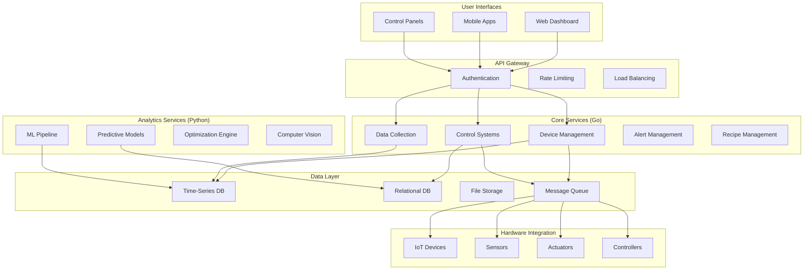

# Software Platform and User Interface Design
## Technical Documentation for Implementation

---

## Table of Contents
1. [Executive Summary](#executive-summary)
2. [Platform Architecture Overview](#platform-architecture-overview)
3. [Technology Stack Strategy](#technology-stack-strategy)
4. [Core Platform Components](#core-platform-components)
5. [User Interface Design](#user-interface-design)
6. [Data Management and Analytics](#data-management-and-analytics)
7. [API Architecture and Integration](#api-architecture-and-integration)
8. [Machine Learning Platform](#machine-learning-platform)
9. [Security and Authentication](#security-and-authentication)
10. [Scalability and Performance](#scalability-and-performance)
11. [Implementation Roadmap](#implementation-roadmap)

---

## Executive Summary

The software platform serves as the central nervous system for soilless agriculture operations, integrating hardware control, data management, user interfaces, and intelligent analytics. This document outlines a comprehensive software architecture utilizing Go for core platform services and Python for machine learning applications, designed to scale from small operations to enterprise-level agricultural facilities.

**Platform Objectives:**
- **Unified Control**: Single platform managing all growing system components
- **Intelligent Automation**: ML-driven optimization and decision-making
- **User Experience**: Intuitive interfaces for operators of all skill levels
- **Data Intelligence**: Transform sensor data into actionable insights
- **Scalability**: Support growth from single facility to multi-site operations

**Core Value Propositions:**
- **Operational Efficiency**: 60-80% reduction in manual monitoring and control tasks
- **Decision Support**: Real-time insights and recommendations for optimal growing conditions
- **Remote Management**: Complete facility control from anywhere with internet access
- **Predictive Capabilities**: Anticipate problems and optimize performance before issues occur
- **Business Intelligence**: Comprehensive analytics for operational and financial optimization

**Technology Strategy:**
- **Go Backend**: High-performance, concurrent services for real-time control and data processing
- **Python ML Stack**: Advanced analytics, machine learning, and predictive modeling
- **Modern Web Frontend**: Responsive, real-time user interfaces for all device types
- **Cloud-Native Architecture**: Scalable, resilient infrastructure supporting multi-tenant operations

---

## Platform Architecture Overview

### System Architecture Philosophy

**Microservices Architecture:**
The platform employs a microservices approach with distinct, loosely-coupled services that can be developed, deployed, and scaled independently. This architecture provides flexibility for different deployment scenarios and allows for targeted optimization of individual components.

**Event-Driven Communication:**
Services communicate through an event-driven architecture using message queues and publish-subscribe patterns. This approach ensures loose coupling, supports eventual consistency, and enables real-time responsiveness across the platform.

**API-First Design:**
All platform functionality is exposed through well-defined APIs, enabling integration with third-party systems, mobile applications, and future platform extensions.

### High-Level Architecture

### Service Architecture Principles

**Single Responsibility:**
Each service has a clearly defined purpose and scope, handling one primary business function. This approach simplifies development, testing, and maintenance while enabling independent scaling and deployment.

**Stateless Design:**
Services are designed to be stateless where possible, with all persistent state stored in dedicated data stores. This approach enables horizontal scaling and improves system resilience.

**Fault Tolerance:**
Services implement circuit breaker patterns, graceful degradation, and retry mechanisms to handle failures gracefully and maintain system availability during partial outages.

**Observable Systems:**
Comprehensive logging, metrics, and tracing enable monitoring of system health, performance optimization, and rapid troubleshooting of issues.

---

## Technology Stack Strategy

### Go Backend Services

**Core Platform Services:**
Go serves as the foundation for all real-time, high-performance backend services. Its concurrent execution model, efficient memory usage, and fast compilation make it ideal for the demanding requirements of agricultural control systems.

**Device Management Service:**
Handles communication with IoT devices, sensors, and controllers. Manages device registration, health monitoring, firmware updates, and real-time data streaming. Implements various communication protocols including MQTT, Modbus, and HTTP.

**Control Systems Service:**
Executes automated control logic for environmental systems, irrigation, lighting, and nutrient delivery. Implements PID controllers, safety interlocks, and scheduling algorithms with microsecond precision timing requirements.

**Data Collection Service:**
High-throughput ingestion and preprocessing of sensor data streams. Handles data validation, filtering, aggregation, and routing to appropriate storage systems and analytics pipelines.

**Alert Management Service:**
Real-time monitoring of system conditions and generation of alerts based on configurable rules. Manages notification delivery through multiple channels including email, SMS, push notifications, and webhook integrations.

**Recipe Management Service:**
Manages growing recipes, environmental setpoints, and automation schedules. Provides versioning, A/B testing capabilities, and integration with optimization algorithms for continuous improvement.

### Python Machine Learning Stack

**Analytics and ML Platform:**
Python ecosystem provides comprehensive tools for data science, machine learning, and advanced analytics. The platform leverages popular libraries and frameworks for building intelligent agricultural systems.

**Predictive Modeling Service:**
Implements machine learning models for yield prediction, disease detection, optimal harvest timing, and resource optimization. Uses frameworks like scikit-learn, TensorFlow, and PyTorch for model development and deployment.

**Computer Vision Service:**
Processes images from cameras throughout the facility to monitor plant growth, detect diseases, assess crop quality, and automate harvest timing decisions. Utilizes OpenCV, PIL, and deep learning frameworks.

**Optimization Engine:**
Implements genetic algorithms, neural networks, and other optimization techniques to continuously improve growing recipes, resource utilization, and operational efficiency.

**Data Pipeline Service:**
ETL processes for preparing data for analysis, feature engineering, model training, and generating business intelligence reports. Uses Pandas, NumPy, and Apache Airflow for workflow orchestration.

### Frontend Technology Stack

**Modern Web Framework:**
React-based single-page application providing responsive, real-time user interfaces. Utilizes modern JavaScript/TypeScript, state management libraries, and component-based architecture for maintainable, scalable frontend development.

**Real-Time Communication:**
WebSocket connections enable real-time updates of sensor data, system status, and alerts without page refreshes. Implements efficient data streaming and automatic reconnection for robust user experience.

**Progressive Web App (PWA):**
Offline capabilities, mobile-responsive design, and app-like experience across all devices. Enables installation on mobile devices and provides functionality even during network outages.

**Data Visualization:**
Advanced charting and visualization libraries for displaying time-series data, trends, system performance, and business intelligence. Interactive dashboards with customizable widgets and drill-down capabilities.

---

## Core Platform Components

### Device Management System

**Device Registration and Discovery:**
Automated discovery and registration of new devices added to the network. Supports plug-and-play configuration with automatic detection of device capabilities, supported protocols, and configuration requirements.

**Device Health Monitoring:**
Continuous monitoring of device status, communication health, battery levels, and performance metrics. Implements heartbeat mechanisms, watchdog timers, and automatic recovery procedures for failed devices.

**Firmware Management:**
Over-the-air firmware updates for supported devices with rollback capabilities. Manages firmware versioning, compatibility checking, and staged deployment to minimize risk of system-wide failures.

**Protocol Abstraction:**
Unified interface for communicating with devices using different protocols (MQTT, Modbus, HTTP, CoAP). Provides consistent API regardless of underlying communication mechanism.

**Device Configuration:**
Centralized management of device settings, calibration parameters, sampling rates, and reporting intervals. Supports bulk configuration changes and device grouping for efficient management.

### Control Systems Engine

**Real-Time Control Loops:**
High-frequency control loops for critical systems like temperature, pH, and nutrient delivery. Implements PID controllers, cascade control, and advanced control algorithms with deterministic timing.

**Safety Interlock System:**
Hardware and software safety interlocks preventing dangerous conditions. Includes emergency shutdown procedures, failsafe modes, and manual override capabilities for critical situations.

**Scheduling Engine:**
Flexible scheduling system for irrigation cycles, lighting programs, nutrient delivery, and maintenance tasks. Supports calendar-based, conditional, and event-driven scheduling with timezone handling.

**Recipe Execution:**
Automated execution of growing recipes with support for growth stage transitions, environmental condition adjustments, and real-time modifications based on sensor feedback.

**Manual Override System:**
Operator interface for manual control of all automated systems while maintaining safety interlocks and logging all manual interventions for audit and analysis purposes.

### Data Collection and Processing

**High-Throughput Data Ingestion:**
Efficient collection and processing of large volumes of sensor data with support for varying sampling rates, data types, and quality indicators. Handles peak loads during data storms and system synchronization.

**Data Validation and Quality Control:**
Real-time validation of incoming sensor data using range checking, consistency analysis, and statistical methods to identify and flag questionable readings for further investigation.

**Data Aggregation and Summarization:**
Automatic generation of summary statistics, trends, and derived metrics from raw sensor data. Supports multiple aggregation periods and customizable calculation methods.

**Data Routing and Distribution:**
Intelligent routing of data to appropriate storage systems, analytics pipelines, alert systems, and external integrations based on data type, priority, and processing requirements.

**Data Retention Management:**
Automated data lifecycle management with configurable retention policies for different data types. Implements data compression, archiving, and deletion to optimize storage costs.

### Alert and Notification System

**Rule-Based Alerting:**
Flexible rule engine for defining alert conditions based on sensor values, trends, system status, and complex multi-variable conditions. Supports threshold alerts, deviation alerts, and predictive alerts.

**Alert Prioritization:**
Multi-level alert classification (critical, warning, informational) with configurable escalation procedures and notification routing based on alert severity and recipient availability.

**Multi-Channel Notifications:**
Support for email, SMS, push notifications, phone calls, and webhook integrations. Implements delivery confirmation, retry mechanisms, and fallback channels for critical alerts.

**Alert Suppression and Management:**
Intelligent alert suppression to prevent notification storms, alert correlation to group related issues, and acknowledgment tracking for operational accountability.

**Integration Capabilities:**
Integration with external systems like building management systems, security systems, and maintenance management platforms for comprehensive facility monitoring.

---

## User Interface Design

### Dashboard Architecture

**Role-Based Dashboards:**
Customized dashboard views for different user roles including operators, managers, technicians, and executives. Each role sees relevant information with appropriate level of detail and control capabilities.

**Real-Time System Overview:**
Central dashboard providing real-time status of all systems, current environmental conditions, active alerts, and key performance indicators. Updates automatically without user intervention.

**Customizable Widget System:**
Drag-and-drop dashboard customization allowing users to arrange information widgets according to their preferences and workflows. Supports saving and sharing dashboard configurations.

**Multi-Facility Management:**
Unified interface for managing multiple growing facilities with facility switching, comparative analytics, and consolidated reporting across all locations.

**Mobile-Responsive Design:**
Fully functional interface on smartphones and tablets with touch-optimized controls and layouts adapted for smaller screens while maintaining full functionality.

### Control Interfaces

**Environmental Control Panel:**
Intuitive controls for adjusting temperature, humidity, CO2 levels, and lighting with real-time feedback and safety confirmation dialogs for significant changes.

**Irrigation and Nutrition Management:**
User-friendly interface for managing irrigation schedules, nutrient recipes, and fertigation programs with visual recipe builders and schedule calendars.

**Recipe Development Interface:**
Advanced interface for creating and modifying growing recipes with support for growth stage definitions, environmental profiles, and A/B testing capabilities.

**System Configuration:**
Administrative interface for configuring devices, setting up alerts, managing user accounts, and adjusting system parameters with guided setup wizards.

**Manual Control Override:**
Emergency and maintenance interfaces providing direct control over individual system components with clear safety warnings and audit logging.

### Monitoring and Analytics Interfaces

**Real-Time Monitoring:**
Live data streams with interactive charts, gauges, and trend displays. Supports zooming, panning, and overlay comparisons of multiple data series.

**Historical Analysis:**
Comprehensive historical data analysis with flexible time range selection, data filtering, and export capabilities. Includes statistical analysis tools and trend identification.

**Performance Analytics:**
Business intelligence dashboards showing production metrics, resource efficiency, cost analysis, and ROI calculations with drill-down capabilities to underlying data.

**Predictive Insights:**
Visual presentation of machine learning predictions and recommendations with confidence intervals, scenario analysis, and decision support tools.

**Report Generation:**
Automated and on-demand report generation with customizable templates, scheduled delivery, and export formats including PDF, Excel, and CSV.

### Mobile Applications

**Operator Mobile App:**
Native mobile application for daily operations including system monitoring, alert management, task completion, and basic control functions optimized for field use.

**Manager Mobile App:**
Executive-level mobile interface focusing on KPIs, alerts, performance summaries, and high-level control functions with approval workflows for significant changes.

**Technician Mobile App:**
Maintenance-focused mobile application with work order management, diagnostic tools, equipment manuals, and direct communication with control systems.

**Customer Portal:**
External-facing mobile application for customers to track their orders, view growing progress, access quality reports, and communicate with production teams.

---

## Data Management and Analytics

### Data Architecture

**Time-Series Data Management:**
Optimized storage and retrieval of sensor data with support for high-frequency data ingestion, efficient compression, and fast query performance across large time ranges.

**Relational Data Management:**
Traditional relational database for configuration data, user accounts, recipes, schedules, and business data with ACID compliance and complex query capabilities.

**Document Storage:**
NoSQL storage for flexible data structures including device configurations, user preferences, report templates, and integration metadata with schema evolution support.

**File and Media Storage:**
Object storage for images, videos, documents, and large datasets with content delivery network integration for fast access and automatic backup.

**Data Lake Architecture:**
Long-term storage of all data types for advanced analytics, machine learning model training, and compliance requirements with cost-effective storage and retrieval.

### Analytics Platform

**Real-Time Analytics:**
Stream processing for immediate insights from incoming sensor data including anomaly detection, trend analysis, and automated decision making with sub-second latency.

**Batch Analytics:**
Scheduled processing of historical data for complex analysis, report generation, and machine learning model training with resource optimization and cost control.

**Interactive Analytics:**
Ad-hoc query capabilities allowing users to explore data, test hypotheses, and generate custom insights without requiring technical expertise or programming skills.

**Predictive Analytics:**
Forward-looking analysis using statistical models and machine learning to predict yields, identify risks, optimize resources, and plan operations.

**Business Intelligence:**
Traditional BI tools and dashboards for operational reporting, financial analysis, compliance reporting, and strategic decision support with self-service capabilities.

### Data Quality and Governance

**Data Quality Management:**
Automated data quality checking including completeness, accuracy, consistency, and timeliness monitoring with data profiling and quality scorecards.

**Data Lineage Tracking:**
Complete tracking of data flow from sensors through processing pipelines to final reports and decisions enabling troubleshooting and compliance auditing.

**Data Security and Privacy:**
Comprehensive data protection including encryption at rest and in transit, access controls, data masking, and compliance with privacy regulations.

**Data Backup and Recovery:**
Automated backup strategies with point-in-time recovery, geographic distribution, and disaster recovery procedures to ensure data availability and business continuity.

**Data Retention Policies:**
Configurable retention policies balancing storage costs with business requirements, regulatory compliance, and analytics needs with automated lifecycle management.

---

## API Architecture and Integration

### RESTful API Design

**Resource-Oriented Architecture:**
Clean, intuitive API design following REST principles with logical resource hierarchies, standard HTTP methods, and consistent response formats enabling easy integration.

**Comprehensive API Coverage:**
Complete API coverage of all platform functionality including device management, data access, control operations, configuration management, and analytics capabilities.

**API Versioning Strategy:**
Backwards-compatible API versioning with clear migration paths, deprecation policies, and support for multiple API versions to accommodate integrations and third-party applications.

**Documentation and Testing:**
Comprehensive API documentation with interactive testing capabilities, code examples, and SDK generation for multiple programming languages.

**Rate Limiting and Quotas:**
Intelligent rate limiting and quota management to ensure fair resource usage, prevent abuse, and maintain system performance under high load conditions.

### Real-Time Communication

**WebSocket Connections:**
Bidirectional real-time communication for live data streaming, instant notifications, and interactive control with automatic reconnection and message queuing.

**Server-Sent Events:**
Unidirectional real-time updates for dashboard displays, alert notifications, and status changes with efficient bandwidth usage and browser compatibility.

**MQTT Integration:**
Native MQTT support for IoT device communication with topic-based routing, quality of service guarantees, and retained message support for device synchronization.

**Webhook Infrastructure:**
Outbound webhook capabilities for notifying external systems of events, data changes, and alerts with retry logic, delivery confirmation, and failure handling.

**GraphQL Support:**
Efficient data fetching with GraphQL queries allowing clients to request exactly the data they need, reducing bandwidth usage and improving performance.

### Third-Party Integrations

**ERP System Integration:**
Seamless integration with enterprise resource planning systems for inventory management, financial reporting, order processing, and supply chain coordination.

**Weather Service Integration:**
Automatic integration with weather services for environmental forecasting, irrigation planning, and climate control optimization with multiple provider support.

**Laboratory Information Systems:**
Integration with external laboratory systems for automated sample tracking, result import, and quality management with configurable data mapping.

**Supply Chain Integration:**
Direct integration with suppliers for automated ordering, delivery scheduling, price updates, and inventory management with approval workflows.

**Customer Management Systems:**
Integration with CRM and customer portal systems for order tracking, customer communication, and quality reporting with customizable customer interfaces.

---

## Machine Learning Platform

### ML Pipeline Architecture

**Data Preparation Pipeline:**
Automated data preprocessing including cleaning, normalization, feature extraction, and dataset preparation with support for both batch and streaming data sources.

**Model Development Environment:**
Integrated development environment for data scientists including Jupyter notebooks, version control, experiment tracking, and collaborative development tools.

**Model Training Infrastructure:**
Scalable training infrastructure supporting various ML frameworks with GPU acceleration, distributed training, and automated hyperparameter optimization.

**Model Deployment Pipeline:**
Automated model deployment with A/B testing, canary releases, model versioning, and rollback capabilities ensuring reliable production deployment.

**Model Monitoring and Management:**
Continuous monitoring of model performance, data drift detection, and automated retraining triggers with model lifecycle management and governance.

### Predictive Analytics Applications

**Yield Prediction Models:**
Machine learning models predicting crop yields based on environmental conditions, growth stage, and historical performance with confidence intervals and scenario analysis.

**Disease Detection and Prevention:**
Computer vision models analyzing plant images to detect early signs of disease, pest infestations, and nutrient deficiencies with automated alert generation.

**Resource Optimization Models:**
Optimization algorithms minimizing water, nutrient, and energy consumption while maximizing yield and quality through continuous learning and adaptation.

**Quality Prediction Models:**
Models predicting final crop quality based on growing conditions, harvest timing, and environmental factors to optimize market value and customer satisfaction.

**Maintenance Prediction Models:**
Predictive maintenance models analyzing equipment sensor data to predict failures, optimize maintenance schedules, and minimize downtime.

### AI-Driven Automation

**Adaptive Control Systems:**
Self-learning control systems that automatically adjust parameters based on performance feedback, environmental changes, and crop response patterns.

**Automated Recipe Optimization:**
Genetic algorithms and neural networks continuously optimizing growing recipes based on yield, quality, and efficiency metrics with multi-objective optimization.

**Intelligent Scheduling:**
AI-powered scheduling systems optimizing resource usage, labor allocation, and production timing based on demand forecasts and capacity constraints.

**Anomaly Detection Systems:**
Unsupervised learning systems automatically identifying unusual patterns in sensor data, system behavior, and crop performance for early problem detection.

**Decision Support Systems:**
AI-powered recommendation engines providing actionable insights and decision support for operators and managers with explanation capabilities.

---

## Security and Authentication

### Authentication and Authorization

**Multi-Factor Authentication:**
Robust authentication system requiring multiple verification factors including passwords, mobile devices, and biometric authentication for sensitive operations.

**Role-Based Access Control:**
Granular permission system with predefined roles (operator, manager, technician, admin) and customizable permissions for specific functions and data access.

**Single Sign-On Integration:**
Integration with enterprise authentication systems including Active Directory, LDAP, and OAuth providers for seamless user experience and centralized management.

**Session Management:**
Secure session handling with automatic timeout, concurrent session limits, and audit logging of all authentication events and permission changes.

**API Security:**
Comprehensive API security including token-based authentication, rate limiting, input validation, and encryption with regular security audits and updates.

### Data Security

**Encryption Standards:**
Industry-standard encryption for data at rest and in transit using AES-256 encryption, TLS 1.3 for communications, and secure key management practices.

**Network Security:**
Comprehensive network security including firewalls, intrusion detection, VPN access, and network segmentation to protect against external and internal threats.

**Data Access Controls:**
Fine-grained data access controls ensuring users only access data relevant to their role and responsibilities with audit logging of all data access.

**Backup Security:**
Encrypted backups with secure storage, access controls, and regular recovery testing to ensure data availability and protection against ransomware attacks.

**Compliance Management:**
Built-in compliance features for industry regulations including audit trails, data retention policies, and privacy controls with automated compliance reporting.

### System Security

**Infrastructure Security:**
Hardened server configurations, regular security updates, vulnerability scanning, and penetration testing to maintain security posture and prevent breaches.

**Application Security:**
Secure coding practices, regular security code reviews, automated security testing, and vulnerability management throughout the development lifecycle.

**Incident Response:**
Comprehensive incident response procedures including detection, containment, investigation, and recovery with communication plans and lessons learned processes.

**Security Monitoring:**
Continuous security monitoring including log analysis, behavior analysis, and threat detection with automated response capabilities and human oversight.

**Business Continuity:**
Disaster recovery and business continuity planning including backup systems, failover procedures, and communication plans to maintain operations during emergencies.

---

## Scalability and Performance

### Horizontal Scaling Architecture

**Microservices Scalability:**
Individual services scale independently based on demand with automatic scaling policies, load balancing, and resource optimization for cost-effective operations.

**Database Scaling:**
Multi-tier database architecture with read replicas, sharding strategies, and caching layers to handle increasing data volumes and query loads efficiently.

**Geographic Distribution:**
Multi-region deployment capabilities supporting global operations with data replication, edge computing, and regional compliance requirements.

**Load Balancing:**
Intelligent load balancing across service instances with health checking, circuit breakers, and failover mechanisms ensuring high availability and performance.

**Auto-Scaling Infrastructure:**
Cloud-native auto-scaling based on CPU, memory, network, and custom metrics with predictive scaling for anticipated load increases.

### Performance Optimization

**Caching Strategies:**
Multi-level caching including in-memory caches, distributed caches, and content delivery networks to minimize latency and reduce database load.

**Database Optimization:**
Query optimization, index management, connection pooling, and query result caching to maintain fast response times as data volumes grow.

**Real-Time Processing:**
Stream processing architecture handling high-velocity data streams with low latency for real-time alerts, control decisions, and dashboard updates.

**Background Processing:**
Asynchronous processing for non-critical tasks including report generation, data analytics, and maintenance operations to maintain responsive user experience.

**Resource Monitoring:**
Comprehensive performance monitoring including application metrics, infrastructure metrics, and user experience metrics with automated alerting and optimization.

### Capacity Planning

**Growth Modeling:**
Predictive modeling of system growth based on business plans, user adoption, and data volume increases with capacity planning recommendations.

**Resource Optimization:**
Continuous optimization of resource allocation based on usage patterns, performance metrics, and cost considerations with automated recommendations.

**Bottleneck Identification:**
Automated identification of performance bottlenecks with root cause analysis and optimization recommendations for maintaining optimal performance.

**Scalability Testing:**
Regular load testing and capacity testing to validate scalability assumptions and identify potential issues before they impact production operations.

**Cost Optimization:**
Ongoing cost optimization including reserved instance planning, resource rightsizing, and usage optimization to minimize operational costs while maintaining performance.

---

## Implementation Roadmap

### Phase 1: Foundation Platform (Months 1-6)

**Core Infrastructure:**
Establish basic platform infrastructure including core Go services for device management, data collection, and control systems with fundamental security and monitoring capabilities.

**Basic User Interface:**
Develop essential web dashboard with real-time monitoring, basic control functions, and alert management providing immediate operational value and user feedback.

**Data Pipeline:**
Implement fundamental data collection, storage, and basic analytics with time-series database, data validation, and essential reporting capabilities.

**Device Integration:**
Complete integration with essential IoT devices, sensors, and control systems providing basic automation and monitoring functionality for operational validation.

**Security Framework:**
Implement core security features including authentication, basic authorization, and data encryption establishing foundation for future development.

### Phase 2: Enhanced Functionality (Months 7-12)

**Advanced Control Systems:**
Develop sophisticated control algorithms, recipe management, and automated scheduling with safety interlocks and comprehensive system integration.

**Mobile Applications:**
Deploy mobile applications for operators and managers with offline capabilities, push notifications, and field-optimized interfaces for enhanced productivity.

**Analytics Platform:**
Implement comprehensive analytics capabilities including historical analysis, performance reporting, and basic predictive analytics for operational optimization.

**API Development:**
Complete RESTful API development with comprehensive documentation, third-party integration capabilities, and webhook infrastructure for ecosystem development.

**Advanced UI Features:**
Enhance user interfaces with customizable dashboards, advanced data visualization, and role-based access controls for improved user experience.

### Phase 3: Intelligence and Scale (Months 13-24)

**Machine Learning Platform:**
Deploy Python-based ML platform with predictive models, computer vision capabilities, and optimization algorithms for intelligent automation and insights.

**Multi-Facility Support:**
Implement multi-site management capabilities with centralized control, comparative analytics, and consolidated reporting for business scaling.

**Advanced Integrations:**
Complete integrations with ERP systems, supply chain partners, and customer management systems for comprehensive business automation.

**Performance Optimization:**
Implement advanced performance optimization including caching, auto-scaling, and resource optimization for efficient large-scale operations.

**Business Intelligence:**
Deploy comprehensive BI platform with self-service analytics, automated reporting, and executive dashboards for strategic decision support.

### Phase 4: Market Leadership (Months 25-36)

**AI-Driven Automation:**
Implement advanced AI capabilities including autonomous control systems, predictive maintenance, and intelligent resource optimization for competitive advantage.

**Ecosystem Platform:**
Develop platform marketplace with third-party integrations, custom applications, and partner ecosystem for comprehensive agricultural technology platform.

**Global Scalability:**
Implement global deployment capabilities with regional compliance, multi-language support, and local market adaptations for international expansion.

**Advanced Analytics:**
Deploy cutting-edge analytics including IoT analytics, edge computing, and real-time optimization for industry-leading operational efficiency.

**Innovation Platform:**
Establish research and development platform for continuous innovation including experimental features, beta testing, and technology partnerships.

---

## Conclusion

The software platform and user interface design outlined in this document provides a comprehensive foundation for building industry-leading soilless agriculture technology. The strategic use of Go for high-performance backend services and Python for machine learning applications creates a robust, scalable platform capable of supporting operations from small facilities to enterprise-scale agricultural businesses.

**Key Success Factors:**
1. **Technology Strategy**: Appropriate technology selection for different platform components optimizing performance, maintainability, and scalability
2. **User-Centric Design**: Interfaces designed for actual agricultural workers with varying technical expertise and operational requirements
3. **Data-Driven Architecture**: Comprehensive data management enabling intelligent automation and continuous optimization
4. **Security-First Approach**: Robust security framework protecting sensitive operational and business data
5. **Scalable Foundation**: Architecture supporting growth from startup to enterprise with minimal technical debt

**Business Value Creation:**
- **Operational Excellence**: Streamlined operations with reduced manual work and improved consistency
- **Intelligent Insights**: Data-driven decision making with predictive analytics and optimization
- **Competitive Advantage**: Advanced technology platform differentiating from traditional agricultural approaches
- **Market Expansion**: Scalable platform supporting growth and new market opportunities
- **Innovation Platform**: Foundation for continuous innovation and technology advancement

**Implementation Success:**
The phased implementation approach ensures early value delivery while building toward comprehensive platform capabilities. Focus on core functionality first establishes operational value and user adoption, while subsequent phases add intelligence and scalability for long-term competitive advantage.

The platform design balances immediate operational needs with long-term strategic capabilities, providing a clear path from initial deployment to market-leading agricultural technology platform.

---

*Document Version: 1.0*  
*Last Updated: January 2025*  
*Next Review: Quarterly*
