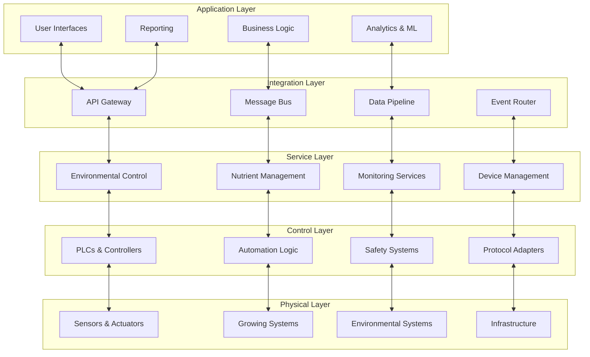
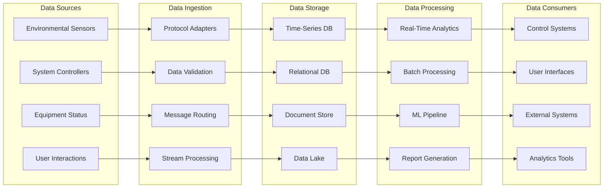

# Overall System Integration Architecture
## Technical Documentation for Implementation

---

## Table of Contents
1. [Executive Summary](#executive-summary)
2. [Integration Architecture Overview](#integration-architecture-overview)
3. [System Boundaries and Interfaces](#system-boundaries-and-interfaces)
4. [Communication Architecture](#communication-architecture)
5. [Data Integration and Flow](#data-integration-and-flow)
6. [Control System Integration](#control-system-integration)
7. [Software Integration Patterns](#software-integration-patterns)
8. [Hardware Integration Architecture](#hardware-integration-architecture)
9. [Operational Integration](#operational-integration)
10. [Testing and Validation Framework](#testing-and-validation-framework)
11. [Deployment and Maintenance Architecture](#deployment-and-maintenance-architecture)

---

## Executive Summary

The system integration architecture serves as the blueprint for unifying all components of a modern soilless agriculture operation into a cohesive, intelligent, and efficient system. This document defines how growing systems, environmental controls, monitoring networks, nutrient delivery, and software platforms integrate to create a seamless agricultural ecosystem that maximizes productivity while minimizing complexity.

**Integration Objectives:**
- **Unified Operation**: All subsystems work together as a single, coordinated entity
- **Seamless Data Flow**: Information flows efficiently between all system components
- **Centralized Control**: Single point of control and monitoring for entire operation
- **Scalable Architecture**: Integration patterns support growth from small to enterprise scale
- **Reliable Operation**: Robust integration ensures system-wide reliability and fault tolerance

**Key Integration Principles:**
- **Loose Coupling**: Systems integrate through well-defined interfaces allowing independent evolution
- **High Cohesion**: Related functions are grouped together for efficient operation and maintenance
- **Standardized Protocols**: Common communication standards enable interoperability and vendor flexibility
- **Event-Driven Architecture**: Responsive systems react to changes and events across the platform
- **Layered Integration**: Clear separation between physical, control, data, and application layers

**Business Value Creation:**
- **Operational Efficiency**: 60-80% reduction in manual coordination and intervention
- **System Optimization**: Holistic optimization across all subsystems rather than individual components
- **Reduced Complexity**: Simplified operations through unified interfaces and automated coordination
- **Enhanced Reliability**: System-wide monitoring and automated recovery from component failures
- **Future-Proof Design**: Architecture supports technology evolution and business growth

---

## Integration Architecture Overview

### Architectural Layers and Patterns

**Five-Layer Integration Architecture:**
The integration follows a layered approach where each layer has specific responsibilities and well-defined interfaces with adjacent layers. This separation enables independent development, testing, and maintenance while ensuring coordinated operation.

### Enterprise Integration Patterns

**Hub-and-Spoke Architecture:**
Central integration hub manages all inter-system communication, providing a single point for routing, transformation, and monitoring of data and control signals between subsystems.

**Event-Driven Integration:**
Systems communicate through events and messages rather than direct coupling, enabling responsive, scalable, and maintainable integration that adapts to changing conditions.

**Service-Oriented Architecture:**
Business functionality is exposed as services with well-defined interfaces, enabling reuse, composition, and independent deployment of system components.

**Message-Oriented Middleware:**
Asynchronous communication through message queues provides reliable, scalable communication that handles varying loads and temporary system unavailability.

**Data Integration Patterns:**
Standardized data models and transformation services ensure consistent data representation across all systems while accommodating different data formats and structures.

### System-Wide Design Principles

**Fault Tolerance and Resilience:**
Integration architecture includes circuit breakers, retry mechanisms, graceful degradation, and automatic failover to maintain operation during component failures.

**Observability and Monitoring:**
Comprehensive logging, metrics, and tracing across all integration points enable rapid troubleshooting, performance optimization, and system health monitoring.

**Security by Design:**
Security is integrated at all levels including authentication, authorization, encryption, and audit trails with zero-trust principles applied throughout.

**Configuration Management:**
Centralized configuration management enables consistent system setup, easy environment promotion, and rapid deployment of configuration changes.

**Version Management:**
API versioning, backward compatibility, and migration strategies ensure smooth system evolution without disrupting existing integrations.

---

## System Boundaries and Interfaces

### Physical System Interfaces

**Growing System Integration Points:**
- **Aeroponics/Hydroponics Systems**: Sensor interfaces for pH, EC, flow, pressure, and level monitoring
- **Environmental Control**: Integration with HVAC, lighting, CO2, and humidity control systems
- **Nutrient Delivery**: Automated mixing, dosing, and delivery system coordination
- **Irrigation Systems**: Zone control, scheduling, and monitoring integration
- **Safety Systems**: Emergency shutdown, leak detection, and alarm integration

**Facility Infrastructure Interfaces:**
- **Electrical Systems**: Power monitoring, load management, and backup power integration
- **Water Systems**: Supply monitoring, treatment status, and quality management
- **Building Management**: Security, access control, and facility monitoring integration
- **Communication Networks**: Ethernet, WiFi, cellular, and serial communication systems
- **Storage Systems**: Climate-controlled storage for supplies and equipment

### Software System Boundaries

**Core Platform Services:**
- **Device Management Service**: Hardware abstraction and device lifecycle management
- **Control Coordination Service**: Cross-system control logic and safety coordination
- **Data Integration Service**: Data collection, validation, and distribution across systems
- **Alert Correlation Service**: System-wide event correlation and intelligent alerting
- **Configuration Management Service**: Centralized configuration and deployment management

**External System Interfaces:**
- **ERP Integration**: Business system connectivity for inventory, finance, and operations
- **Supply Chain Systems**: Vendor integration for ordering, tracking, and inventory management
- **Customer Systems**: Order management, tracking, and customer communication platforms
- **Regulatory Systems**: Compliance reporting and regulatory data submission
- **Maintenance Systems**: Work order management and maintenance scheduling integration

### Data Boundaries and Ownership

**Master Data Management:**
- **Device Registry**: Authoritative source for all device information and capabilities
- **Recipe Database**: Central repository for growing recipes and formulations
- **User Management**: Centralized authentication and authorization across all systems
- **Configuration Repository**: Single source of truth for all system configurations
- **Audit Trail**: Comprehensive logging of all system changes and user actions

**Data Domains:**
- **Operational Data**: Real-time sensor data, control commands, and system status
- **Business Data**: Orders, inventory, financial, and customer information
- **Analytical Data**: Historical trends, performance metrics, and predictive models
- **Configuration Data**: System settings, recipes, schedules, and user preferences
- **Audit Data**: Compliance records, change logs, and security events

---

## Communication Architecture

### Communication Protocols and Standards

**Industrial Communication Protocols:**
- **Modbus TCP/RTU**: Device communication for sensors, controllers, and actuators
- **BACnet/IP**: Building automation integration for HVAC and facility systems
- **OPC-UA**: Standardized industrial communication with security and metadata
- **MQTT**: IoT device communication with publish-subscribe messaging
- **EtherNet/IP**: Real-time industrial ethernet for time-critical control applications

**IT Communication Protocols:**
- **HTTP/HTTPS**: RESTful APIs for service-to-service communication
- **WebSocket**: Real-time bidirectional communication for user interfaces
- **gRPC**: High-performance RPC for internal service communication
- **AMQP**: Message queue protocol for asynchronous service communication
- **GraphQL**: Flexible data query language for efficient client-server communication

### Message Bus Architecture

**Enterprise Service Bus (ESB):**
Central message routing infrastructure that handles protocol transformation, message routing, data transformation, and integration orchestration between all system components.

**Message Queue Implementation:**
- **High Availability**: Clustered message brokers with automatic failover
- **Durable Messaging**: Persistent message storage ensuring no data loss
- **Message Ordering**: Guaranteed message ordering for critical control sequences
- **Dead Letter Queues**: Handling of undeliverable messages with retry logic
- **Message Transformation**: Automatic data format conversion between systems

**Event Streaming Platform:**
Real-time event streaming for high-volume data flows including sensor data, system events, and user actions with support for event replay and stream processing.

### Network Architecture

**Network Segmentation:**
- **Control Network**: Isolated network for critical control systems and safety functions
- **Data Network**: High-bandwidth network for data collection and processing
- **Management Network**: Administrative access and system management functions
- **Guest Network**: External access for vendors, customers, and temporary users
- **IoT Network**: Dedicated network for IoT devices with security isolation

**Quality of Service (QoS):**
- **Critical Control Traffic**: Highest priority for safety and control systems
- **Real-Time Data**: High priority for sensor data and monitoring information
- **Business Applications**: Standard priority for business and administrative functions
- **Background Processes**: Lower priority for backups, updates, and maintenance
- **Guest Traffic**: Lowest priority with bandwidth limitations

**Network Redundancy:**
- **Multiple Internet Connections**: Primary and backup internet connectivity
- **Network Path Redundancy**: Multiple routes for critical communications
- **Wireless Backup**: Cellular or satellite backup for primary network failures
- **Local Network Resilience**: Mesh networking and automatic rerouting capabilities
- **Edge Computing**: Local processing capabilities during network outages

---

## Data Integration and Flow

### Data Flow Architecture

**Real-Time Data Streams:**
Continuous flow of sensor data, control commands, and system status information requiring low-latency processing and immediate response capabilities.

### Data Transformation and Mapping

**Universal Data Model:**
Standardized data representation across all systems enabling consistent data exchange while accommodating different source formats and requirements.

**Transformation Services:**
- **Protocol Translation**: Convert between different communication protocols and data formats
- **Unit Conversion**: Automatic conversion between different measurement units and scales
- **Data Enrichment**: Adding context, metadata, and calculated fields to raw data
- **Data Validation**: Ensuring data quality and consistency across all integration points
- **Schema Evolution**: Managing changes in data structures without breaking existing integrations

**Data Synchronization:**
- **Master Data Synchronization**: Ensuring consistency of reference data across all systems
- **Conflict Resolution**: Automated and manual processes for resolving data conflicts
- **Change Data Capture**: Tracking and propagating data changes across integrated systems
- **Eventual Consistency**: Managing temporary inconsistencies in distributed data
- **Data Lineage**: Tracking data flow and transformations for audit and troubleshooting

### Integration Data Patterns

**Command Query Responsibility Segregation (CQRS):**
Separate read and write models optimizing for different access patterns and enabling independent scaling of query and command processing.

**Event Sourcing:**
Storing all changes as events enabling complete audit trails, system state reconstruction, and complex event processing for business insights.

**Saga Pattern:**
Managing distributed transactions across multiple systems with compensation mechanisms for handling failures in long-running business processes.

**Data Federation:**
Virtual integration of data from multiple sources without physical data movement enabling real-time access to distributed information.

**Change Data Capture (CDC):**
Real-time capture and propagation of data changes enabling responsive integration and maintaining data consistency across systems.

---

## Control System Integration

### Hierarchical Control Architecture

**Level 0 - Field Devices:**
Direct interface with physical processes including sensors, actuators, and basic controllers with minimal processing capabilities and direct hardware control.

**Level 1 - Process Control:**
PLCs and local controllers implementing basic control loops, safety functions, and equipment automation with real-time response requirements.

**Level 2 - Supervisory Control:**
SCADA systems and supervisory controllers coordinating multiple process controllers and providing operator interfaces for system management.

**Level 3 - Plant Management:**
Manufacturing Execution Systems (MES) managing production schedules, recipes, quality control, and coordination between different production areas.

**Level 4 - Business Management:**
Enterprise Resource Planning (ERP) systems handling business processes, financial management, supply chain, and strategic planning functions.

### Control System Coordination

**Multi-System Control Logic:**
Coordination between environmental control, nutrient delivery, lighting, and irrigation systems ensuring optimal growing conditions and resource utilization.

**Safety System Integration:**
- **Emergency Shutdown Systems**: Coordinated shutdown procedures across all systems
- **Safety Interlock Networks**: Preventing unsafe conditions through cross-system monitoring
- **Alarm Management**: Intelligent alarm correlation and prioritization across all systems
- **Redundant Safety Systems**: Backup safety mechanisms for critical functions
- **Manual Override Capabilities**: Operator control during emergencies or maintenance

**Control State Management:**
- **Operational Modes**: Automatic, manual, maintenance, and emergency operating modes
- **State Synchronization**: Coordinated state changes across all integrated systems
- **Mode Transitions**: Safe transitions between different operational states
- **Configuration Management**: Consistent control configuration across all systems
- **Version Control**: Managing control logic versions and deployment coordination

### Real-Time Control Integration

**Deterministic Control Loops:**
Time-critical control functions with guaranteed response times for safety and quality control applications requiring precise timing.

**Control System Synchronization:**
Coordinated timing between different control systems ensuring proper sequencing and avoiding conflicts in control actions.

**Distributed Control Coordination:**
Multiple control systems working together with shared objectives while maintaining local autonomy for their specific processes.

**Predictive Control Integration:**
Model predictive control across multiple systems optimizing overall system performance rather than individual subsystem optimization.

**Adaptive Control Networks:**
Self-tuning control systems that adjust parameters based on system performance and changing conditions with machine learning integration.

---

## Software Integration Patterns

### Service Integration Patterns

**API Gateway Pattern:**
Single entry point for all external access providing authentication, rate limiting, request routing, and response aggregation while hiding internal system complexity.

**Backend for Frontend (BFF):**
Specialized API layers for different client types (web, mobile, third-party) optimizing data format and functionality for specific use cases.

**Service Mesh Architecture:**
Infrastructure layer handling service-to-service communication including load balancing, security, monitoring, and traffic management.

**Circuit Breaker Pattern:**
Preventing cascade failures by detecting service failures and redirecting requests to backup services or providing graceful degradation.

**Bulkhead Pattern:**
Isolating critical functions to prevent resource exhaustion in one area from affecting other system functions.

### Data Integration Patterns

**Database per Service:**
Each microservice maintains its own database ensuring loose coupling while requiring careful design of cross-service data access.

**Shared Database Anti-Pattern Management:**
Where shared databases exist, careful interface design and change management prevent tight coupling between services.

**Event-Driven Data Integration:**
Services publish events when data changes, allowing other services to maintain eventually consistent views without direct database coupling.

**API Composition Pattern:**
Aggregating data from multiple services to provide comprehensive views while maintaining service boundaries and avoiding distributed joins.

**Data Synchronization Services:**
Specialized services managing data consistency across multiple systems with conflict resolution and eventual consistency guarantees.

### Integration Testing Patterns

**Contract Testing:**
Automated testing of service interfaces ensuring compatibility between service providers and consumers without requiring full system integration.

**Service Virtualization:**
Mock services simulating external dependencies enabling testing of integration logic without requiring full system availability.

**Chaos Engineering:**
Deliberately introducing failures to test system resilience and integration robustness under adverse conditions.

**End-to-End Testing:**
Comprehensive testing of complete business processes across all integrated systems ensuring proper functionality of the entire system.

**Integration Monitoring:**
Continuous monitoring of integration points with automated alerts for performance degradation or failure conditions.

---

## Hardware Integration Architecture

### Device Integration Framework

**Universal Device Abstraction:**
Common interface for different device types hiding communication protocol and vendor differences while exposing standardized functionality.

**Device Discovery and Registration:**
Automatic detection and configuration of new devices with plug-and-play capabilities reducing installation and configuration complexity.

**Device Lifecycle Management:**
Complete management of device lifetime including provisioning, configuration, monitoring, updates, and decommissioning.

**Protocol Gateway Services:**
Translation between different communication protocols enabling integration of devices using different standards in a unified system.

**Edge Computing Integration:**
Local processing capabilities at the device level reducing network traffic and enabling local decision-making with cloud coordination.

### Sensor Network Integration

**Multi-Protocol Sensor Support:**
Integration of sensors using different communication protocols (Modbus, MQTT, HTTP, serial) through standardized interfaces.

**Sensor Data Fusion:**
Combining data from multiple sensors to provide more accurate and reliable measurements with automatic quality assessment.

**Calibration Management:**
Automated and manual calibration procedures with tracking of calibration status and scheduled maintenance reminders.

**Sensor Health Monitoring:**
Continuous monitoring of sensor performance with predictive maintenance and automatic failure detection.

**Data Quality Assurance:**
Real-time validation of sensor data with outlier detection, range checking, and consistency analysis across related sensors.

### Actuator and Control Integration

**Actuator Coordination:**
Synchronized control of multiple actuators ensuring proper sequencing and avoiding conflicts in control actions.

**Feedback Loop Integration:**
Closed-loop control systems integrating sensors and actuators with control algorithms ensuring precise process control.

**Safety System Integration:**
Integration of safety interlocks and emergency shutdown systems with normal control operations ensuring safe system operation.

**Manual Override Integration:**
Operator interfaces for manual control of actuators while maintaining safety interlocks and audit logging.

**Performance Monitoring:**
Monitoring of actuator performance and efficiency with predictive maintenance and optimization recommendations.

---

## Operational Integration

### Business Process Integration

**Production Planning Integration:**
Coordination between growing schedules, resource availability, market demand, and facility capacity for optimal production planning.

**Quality Management Integration:**
Integration of quality control processes with production systems ensuring consistent product quality and regulatory compliance.

**Inventory Management Integration:**
Real-time tracking of supplies, nutrients, and consumables with automated reordering and supply chain coordination.

**Maintenance Management Integration:**
Integration of maintenance schedules with production schedules and resource availability ensuring minimal disruption to operations.

**Financial Integration:**
Cost tracking and allocation across all systems enabling accurate cost accounting and profitability analysis.

### Workflow Integration

**Automated Workflow Orchestration:**
Business process automation spanning multiple systems with human approval steps and exception handling.

**Task Management Integration:**
Assignment and tracking of tasks across different systems with notification and escalation procedures.

**Document Management Integration:**
Centralized document storage and management with version control and access management integrated with business processes.

**Approval Workflow Integration:**
Multi-step approval processes for significant changes to system configuration, recipes, or operational parameters.

**Compliance Workflow Integration:**
Automated compliance checking and reporting with integration to regulatory systems and audit trail maintenance.

### User Experience Integration

**Single Sign-On (SSO):**
Unified authentication across all systems providing seamless user experience and centralized access management.

**Unified User Interface:**
Consistent user interface design and navigation across all system components reducing training requirements and improving efficiency.

**Role-Based Access Integration:**
Coordinated access control across all systems based on user roles and responsibilities with centralized management.

**Notification Integration:**
Unified notification system aggregating alerts and information from all systems with intelligent filtering and routing.

**Mobile Integration:**
Consistent mobile experience across all system functions with offline capabilities and synchronization.

---

## Testing and Validation Framework

### Integration Testing Strategy

**Component Integration Testing:**
Testing of interfaces between individual components ensuring proper data flow and function calls between system parts.

**System Integration Testing:**
Testing of complete subsystems working together ensuring proper coordination and data flow between major system components.

**End-to-End Integration Testing:**
Testing of complete business processes across all integrated systems ensuring proper functionality from user input to final output.

**Performance Integration Testing:**
Testing of system performance under realistic load conditions ensuring proper operation at expected traffic and data volumes.

**Security Integration Testing:**
Testing of security controls across all integration points ensuring proper authentication, authorization, and data protection.

### Test Environment Management

**Test Data Management:**
Consistent test data across all systems with data masking for sensitive information and realistic test scenarios.

**Environment Provisioning:**
Automated creation and management of test environments matching production configurations with isolated test data.

**Test Automation Framework:**
Automated testing of integration points with continuous integration and regression testing capabilities.

**Mock Service Management:**
Simulation of external services and systems enabling testing without dependencies on external systems.

**Test Result Management:**
Centralized collection and analysis of test results with trend analysis and quality metrics tracking.

### Validation Procedures

**Functional Validation:**
Verification that all integrated functions work correctly according to specifications with complete test coverage.

**Performance Validation:**
Verification that integrated systems meet performance requirements under expected load conditions.

**Security Validation:**
Verification of security controls and compliance with security policies across all integration points.

**Operational Validation:**
Verification that integrated systems support all operational procedures and workflows.

**Compliance Validation:**
Verification that integrated systems meet all regulatory and industry compliance requirements.

---

## Deployment and Maintenance Architecture

### Deployment Strategy

**Blue-Green Deployment:**
Parallel deployment environments enabling zero-downtime deployments with instant rollback capabilities for production systems.

**Canary Deployment:**
Gradual rollout of changes to small portions of the system enabling early detection of issues before full deployment.

**Feature Toggle Management:**
Controlled activation of new features enabling gradual rollout and easy rollback without full system deployment.

**Infrastructure as Code:**
Automated infrastructure provisioning and management ensuring consistent environments and simplified deployment processes.

**Configuration Management:**
Centralized configuration management with version control and automated deployment of configuration changes.

### Monitoring and Observability

**Distributed Tracing:**
End-to-end tracking of requests across all integrated systems enabling performance analysis and troubleshooting.

**Application Performance Monitoring:**
Real-time monitoring of application performance with automatic anomaly detection and performance optimization recommendations.

**Infrastructure Monitoring:**
Comprehensive monitoring of all infrastructure components with predictive analysis and capacity planning.

**Business Metrics Monitoring:**
Monitoring of key business metrics and performance indicators with automated reporting and alerting.

**Security Monitoring:**
Continuous security monitoring with threat detection and automated response capabilities.

### Maintenance and Support

**Centralized Logging:**
Unified log collection and analysis across all systems enabling rapid troubleshooting and system analysis.

**Remote Diagnostics:**
Remote access capabilities for system diagnostics and troubleshooting with secure access controls.

**Automated Backup Systems:**
Comprehensive backup strategies with automated testing and recovery procedures ensuring data protection.

**Disaster Recovery:**
Complete disaster recovery planning with automated failover and recovery procedures ensuring business continuity.

**Vendor Coordination:**
Managed relationships with all technology vendors ensuring coordinated support and maintenance activities.

---

## Conclusion

The system integration architecture serves as the foundational framework that transforms individual agricultural technology components into a unified, intelligent, and efficient operation. This comprehensive integration approach ensures that all systems work together seamlessly while maintaining the flexibility to evolve and scale with business needs.

**Integration Success Factors:**
1. **Layered Architecture**: Clear separation of concerns enabling independent development and maintenance
2. **Standardized Interfaces**: Common protocols and data formats ensuring interoperability and vendor flexibility
3. **Event-Driven Design**: Responsive architecture adapting to changing conditions and requirements
4. **Comprehensive Testing**: Thorough validation ensuring reliable operation under all conditions
5. **Operational Integration**: Seamless integration with business processes and workflows

**Business Value Realization:**
- **Unified Operations**: Single platform managing all aspects of agricultural production
- **Intelligent Automation**: Coordinated automation across all systems optimizing overall performance
- **Reduced Complexity**: Simplified operations through integrated interfaces and automated coordination
- **Enhanced Reliability**: System-wide monitoring and automated recovery ensuring continuous operation
- **Scalable Growth**: Architecture supporting business expansion and technology evolution

**Implementation Approach:**
The integration architecture provides a roadmap for systematic implementation starting with core integration capabilities and expanding to comprehensive system coordination. Focus on standardized interfaces and event-driven patterns ensures smooth integration while maintaining system flexibility.

**Future Evolution:**
The architecture supports continuous evolution with new technologies, changing requirements, and business growth. The layered approach and standardized interfaces enable gradual enhancement and technology refresh without disrupting existing operations.

This integration architecture creates the foundation for building world-class agricultural technology platforms that deliver superior operational efficiency, product quality, and business performance while providing the flexibility to adapt to changing market conditions and technological advances.

---

*Document Version: 1.0*  
*Last Updated: January 2025*  
*Next Review: Quarterly*
