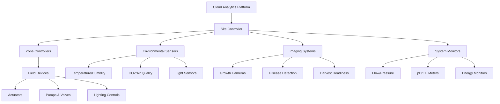
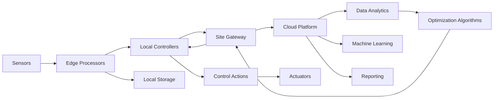

# Monitoring and Automation Systems: Sensors, IoT & Data Collection
## Technical Documentation for Implementation

---

## Table of Contents
1. [Executive Summary](#executive-summary)
2. [System Architecture Overview](#system-architecture-overview)
3. [Sensor Technologies](#sensor-technologies)
4. [IoT Infrastructure](#iot-infrastructure)
5. [Data Collection Systems](#data-collection-systems)
6. [Automation and Control Logic](#automation-and-control-logic)
7. [Communication Protocols](#communication-protocols)
8. [Data Analytics and Intelligence](#data-analytics-and-intelligence)
9. [Security and Reliability](#security-and-reliability)
10. [Technical Specifications](#technical-specifications)
11. [Implementation Strategy](#implementation-strategy)

---

## Executive Summary

Monitoring and automation systems form the intelligent backbone of modern soilless agriculture operations. These systems integrate sensors, IoT devices, data collection platforms, and automated controls to optimize growing conditions, maximize yields, and minimize operational complexity. This document provides comprehensive technical guidance for designing and implementing robust monitoring and automation infrastructure.

**Core System Components:**
- **Sensor Networks**: Environmental, plant health, and system performance monitoring
- **IoT Infrastructure**: Edge computing, wireless connectivity, and device management
- **Data Systems**: Real-time collection, storage, and analysis platforms
- **Automation Logic**: Intelligent control algorithms and decision-making systems

**Key Benefits:**
- **Operational Efficiency**: 60-80% reduction in manual monitoring tasks
- **Yield Optimization**: 15-30% improvement through precise environmental control
- **Resource Conservation**: 20-40% reduction in water and nutrient waste
- **Risk Mitigation**: Early detection of problems prevents crop losses
- **Scalability**: Centralized management of multiple growing zones and facilities

---

## System Architecture Overview

### Hierarchical Control Architecture



### Data Flow Architecture



### System Integration Layers

**Device Layer:**
- Physical sensors and measurement devices
- Actuators and control hardware
- Edge computing nodes for local processing

**Communication Layer:**
- Wireless and wired connectivity protocols
- Data aggregation and protocol translation
- Network security and device authentication

**Control Layer:**
- Real-time control algorithms
- Safety interlocks and alarm systems
- Local decision making and automation

**Data Layer:**
- Time-series databases for sensor data
- Relational databases for configuration and metadata
- File storage for images and reports

**Application Layer:**
- User interfaces and dashboards
- Analytics and reporting tools
- Integration APIs and web services

---

## Sensor Technologies

### Environmental Sensors

#### Temperature Monitoring
**Sensor Technologies:**
- **RTD (Resistance Temperature Detectors)**: Highest accuracy (±0.1°C)
- **Thermocouples**: Wide temperature range, fast response
- **Thermistors**: Good sensitivity, cost-effective for moderate precision
- **Digital Temperature Sensors**: Integrated circuits with digital output

**Implementation Specifications:**
- **Accuracy Requirements**: ±0.5°C for general monitoring, ±0.1°C for critical control
- **Response Time**: T90 < 30 seconds in air, < 10 seconds in liquid
- **Operating Range**: -40°C to +125°C for greenhouse applications
- **Resolution**: 0.1°C minimum, 0.01°C for precision applications

**Placement Strategy:**
- **Canopy Level**: 6-12 inches above plant tops
- **Root Zone**: Direct measurement in growing medium
- **Air Intake/Exhaust**: Monitor HVAC performance
- **Multiple Heights**: Detect temperature stratification

#### Humidity Measurement
**Sensor Technologies:**
- **Capacitive Sensors**: Fast response, good accuracy over wide range
- **Resistive Sensors**: Lower cost, adequate for basic monitoring
- **Chilled Mirror**: Laboratory-grade accuracy, higher maintenance
- **Digital Combo Sensors**: Integrated temperature and humidity

**Performance Specifications:**
- **Accuracy**: ±2% RH for control applications, ±1% RH for precision
- **Range**: 0-100% RH measurement capability
- **Response Time**: T90 < 15 seconds for rapid changes
- **Long-term Stability**: <1% drift per year maximum

**Installation Considerations:**
- **Ventilated Enclosures**: Protect from direct water contact
- **Representative Locations**: Avoid dead air spaces
- **Calibration Access**: Easy removal for periodic verification
- **Multiple Zones**: Independent monitoring of different growing areas

#### CO2 Monitoring
**Measurement Technologies:**
- **NDIR (Non-Dispersive Infrared)**: Most common, reliable, accurate
- **Electrochemical Sensors**: Lower cost, shorter lifespan
- **Photoacoustic Sensors**: High precision, research applications

**Technical Requirements:**
- **Range**: 0-2000 ppm standard, 0-5000 ppm for CO2 enrichment
- **Accuracy**: ±30 ppm ±3% of reading for control applications
- **Resolution**: 1 ppm minimum resolution
- **Calibration Stability**: Automatic background calibration capability

**Implementation Best Practices:**
- **Air Sampling**: Aspirated systems for representative measurements
- **Location**: Away from direct CO2 sources and exhaust points
- **Maintenance**: Easy access for calibration and service
- **Redundancy**: Multiple sensors for critical control loops

#### Light Measurement
**Sensor Types:**
- **PAR Sensors**: Quantum sensors measuring PPFD (μmol/m²/s)
- **Lux Meters**: Human-visible light measurement
- **UV Sensors**: Ultraviolet radiation monitoring
- **Spectral Sensors**: Multi-wavelength analysis

**PAR Sensor Specifications:**
- **Spectral Range**: 400-700 nm photosynthetically active radiation
- **Accuracy**: ±5% under LED lighting conditions
- **Range**: 0-2000+ μmol/m²/s measurement capability
- **Cosine Response**: Accurate measurement from all angles

**Deployment Strategy:**
- **Canopy Level**: Representative plant height measurements
- **Grid Pattern**: Multiple sensors for uniformity mapping
- **Reference Points**: Fixed locations for trend monitoring
- **Mobile Sensors**: Handheld units for spot measurements

### Plant Health Monitoring

#### Growth Monitoring Systems
**Imaging Technologies:**
- **RGB Cameras**: Visual inspection, growth tracking
- **Multispectral Cameras**: Stress detection, health analysis
- **Thermal Cameras**: Heat stress, irrigation monitoring
- **3D Scanning**: Growth rate, biomass estimation

**Computer Vision Applications:**
- **Growth Rate Tracking**: Automated plant size measurements
- **Disease Detection**: Early identification of plant diseases
- **Pest Monitoring**: Automated insect and pest detection
- **Harvest Readiness**: Maturity assessment and timing

**Implementation Requirements:**
- **Lighting Control**: Consistent illumination for image quality
- **Positioning Systems**: Automated camera movement and focusing
- **Edge Processing**: Local image analysis to reduce data transfer
- **Storage Management**: Efficient compression and archival systems

#### Plant Physiological Sensors
**Advanced Monitoring:**
- **Chlorophyll Fluorescence**: Photosynthetic efficiency measurement
- **Sap Flow Sensors**: Plant water uptake and stress indicators
- **Stem Diameter Sensors**: Growth rate and water stress detection
- **Leaf Temperature**: Non-contact infrared measurements

### System Performance Monitoring

#### Water and Nutrient Systems
**Flow Monitoring:**
- **Electromagnetic Flow Meters**: High accuracy, no pressure loss
- **Turbine Flow Meters**: Mechanical, lower cost option
- **Ultrasonic Flow Meters**: Non-invasive, easy retrofit
- **Mass Flow Controllers**: Precise nutrient injection control

**Water Quality Sensors:**
- **pH Sensors**: Glass electrode or ISFET technology
- **EC/TDS Sensors**: Conductivity measurement for nutrient concentration
- **Dissolved Oxygen**: Critical for root health in hydroponic systems
- **Turbidity**: Water clarity and filtration system performance

**Pressure and Level Monitoring:**
- **Pressure Transducers**: System pressure monitoring and leak detection
- **Ultrasonic Level Sensors**: Non-contact reservoir level measurement
- **Float Switches**: Simple high/low level indication
- **Load Cells**: Weight-based inventory monitoring

#### Energy and Equipment Monitoring
**Power Monitoring:**
- **Energy Meters**: kWh consumption tracking by circuit
- **Power Quality Analyzers**: Voltage, current, harmonics analysis
- **Motor Current Sensors**: Equipment health and efficiency monitoring
- **Peak Demand Meters**: Electrical demand management

**Equipment Status Monitoring:**
- **Vibration Sensors**: Pump and fan bearing health
- **Temperature Sensors**: Motor and equipment overheating detection
- **Run Time Meters**: Maintenance scheduling based on operating hours
- **Fault Detection**: Integration with equipment control systems

---

## IoT Infrastructure

### Edge Computing Architecture

#### Edge Device Specifications
**Processing Requirements:**
- **CPU**: ARM Cortex-A series or equivalent, 1+ GHz
- **Memory**: 1GB+ RAM, 8GB+ storage for data buffering
- **Connectivity**: WiFi, Ethernet, optional cellular backup
- **I/O Expansion**: Modbus, analog/digital I/O, sensor interfaces
- **Operating System**: Linux-based for flexibility and security

**Edge Functions:**
- **Local Control**: Real-time responses without cloud dependency
- **Data Preprocessing**: Filtering, aggregation, and compression
- **Protocol Translation**: Convert between sensor and network protocols
- **Caching**: Local storage during network outages
- **Security**: Device authentication and data encryption

#### Gateway Infrastructure
**IoT Gateway Capabilities:**
- **Multi-Protocol Support**: Modbus, MQTT, CoAP, HTTP/HTTPS
- **Device Management**: Automatic discovery and configuration
- **Data Aggregation**: Collect and forward sensor data efficiently
- **Edge Analytics**: Local processing for immediate decision making
- **Remote Management**: Secure remote access and updates

### Wireless Connectivity

#### WiFi Networks
**Infrastructure Requirements:**
- **Coverage**: Reliable signal throughout growing areas
- **Bandwidth**: Sufficient for continuous sensor data streaming
- **Security**: WPA3 encryption and enterprise authentication
- **Redundancy**: Multiple access points for coverage reliability
- **Power**: PoE+ capability for sensors and devices

**Network Architecture:**
- **VLANs**: Separate IoT traffic from administrative networks
- **Quality of Service**: Prioritize critical control traffic
- **Mesh Capability**: Self-healing network topology
- **Guest Access**: Separate network for visitors and contractors

#### Low-Power Wide Area Networks (LPWAN)
**LoRaWAN Implementation:**
- **Range**: Up to 10km outdoor, 2km indoor coverage
- **Battery Life**: 10+ years for low-duty-cycle sensors
- **Data Rates**: 0.3-37.5 kbps, suitable for sensor data
- **Network Topology**: Star topology with gateway and end nodes

**Cellular IoT Options:**
- **NB-IoT**: Narrow-band cellular for low-power sensors
- **Cat-M1**: Higher bandwidth cellular for more data-intensive applications
- **5G**: High-bandwidth, low-latency for advanced applications

### Network Infrastructure

#### Local Area Network (LAN)
**Wired Infrastructure:**
- **Ethernet Backbone**: Gigabit switches for high-bandwidth applications
- **Power over Ethernet (PoE)**: PoE+ standard for device power
- **Cable Management**: Organized distribution for maintenance access
- **Redundancy**: Link aggregation and failover paths

**Network Segmentation:**
- **Control Network**: Critical automation and safety systems
- **Data Network**: Sensor data collection and monitoring
- **Management Network**: Administrative and maintenance access
- **Guest Network**: Visitor and contractor internet access

#### Wide Area Network (WAN)
**Internet Connectivity:**
- **Primary Connection**: High-speed fiber or cable internet
- **Backup Connection**: Cellular or satellite for redundancy
- **Bandwidth Requirements**: Based on data volume and remote access needs
- **Quality of Service**: Guaranteed bandwidth for critical applications

---

## Data Collection Systems

### Time-Series Database Architecture

#### Database Selection Criteria
**Time-Series Databases:**
- **InfluxDB**: Popular open-source option with good performance
- **TimescaleDB**: PostgreSQL extension, familiar SQL interface
- **Prometheus**: Metrics collection and alerting system
- **Amazon Timestream**: Managed cloud service option

**Performance Requirements:**
- **Write Throughput**: 10,000+ points per second capability
- **Query Performance**: Sub-second response for dashboard queries
- **Data Retention**: Configurable policies for different data types
- **Compression**: Efficient storage of historical data

#### Data Schema Design
**Measurement Structure:**
```
Sensor Data Point:
├── Timestamp: UTC time with millisecond precision
├── Measurement: Temperature, humidity, pH, etc.
├── Value: Numerical sensor reading
├── Unit: Engineering units (°C, %, μmol/m²/s)
├── Quality: Data quality indicator
├── Tags: Location, sensor_id, zone, crop_type
└── Metadata: Calibration, maintenance records
```

**Data Organization:**
- **By Location**: Separate databases or retention policies per site
- **By System**: Environmental, irrigation, lighting, equipment data
- **By Frequency**: High-frequency control data vs. trend data
- **By Importance**: Critical alarms vs. informational logging

### Data Ingestion Pipeline

#### Real-Time Data Processing
**Stream Processing:**
- **Apache Kafka**: High-throughput message streaming platform
- **Apache Flink**: Real-time stream processing and analytics
- **Redis**: In-memory data structure store for caching
- **Message Queuing**: RabbitMQ or similar for reliable delivery

**Data Validation:**
- **Range Checking**: Verify sensor values within expected limits
- **Consistency Checks**: Cross-reference related measurements
- **Missing Data Handling**: Interpolation or flagging strategies
- **Duplicate Detection**: Prevent double-counting of measurements

#### Batch Data Processing
**Historical Analysis:**
- **Apache Spark**: Large-scale data processing and analytics
- **ETL Pipelines**: Extract, transform, load processes
- **Data Warehousing**: Structured storage for business intelligence
- **Report Generation**: Automated periodic reporting

### Data Storage Architecture

#### Storage Tiers
**Hot Storage (Active Data):**
- **Time Range**: Last 30-90 days of detailed data
- **Access Pattern**: Frequent queries and real-time access
- **Technology**: SSD storage for fast access times
- **Retention**: Full resolution sensor data

**Warm Storage (Recent Historical):**
- **Time Range**: 3 months to 2 years
- **Access Pattern**: Periodic analysis and reporting
- **Technology**: Traditional hard drives or cloud storage
- **Retention**: Reduced resolution aggregated data

**Cold Storage (Archive):**
- **Time Range**: Long-term historical records
- **Access Pattern**: Infrequent access for compliance or analysis
- **Technology**: Object storage or tape backup systems
- **Retention**: Summary data and key events only

#### Backup and Recovery
**Backup Strategy:**
- **Real-Time Replication**: Synchronous backup to secondary systems
- **Incremental Backups**: Daily incremental backups to cloud storage
- **Point-in-Time Recovery**: Ability to restore to specific timestamps
- **Geographic Distribution**: Backups stored in multiple locations

---

## Automation and Control Logic

### Control System Architecture

#### Programmable Logic Controllers (PLCs)
**PLC Specifications:**
- **Processor**: Industrial-grade CPU with real-time operation
- **I/O Capacity**: Expandable analog and digital input/output modules
- **Communication**: Ethernet, Modbus, Profibus, or DeviceNet
- **Programming**: Ladder logic, structured text, or function block
- **Redundancy**: Hot-standby capability for critical applications

**PLC Application Areas:**
- **Safety Systems**: Emergency shutdowns and interlocks
- **Equipment Control**: Pumps, valves, fans, and actuators
- **Process Control**: PID loops for temperature, pH, and flow
- **Sequencing**: Irrigation cycles, lighting schedules

#### Distributed Control Systems (DCS)
**System Architecture:**
- **Process Controllers**: Dedicated controllers for specific loops
- **Operator Stations**: Human-machine interface (HMI) workstations
- **Engineering Station**: System configuration and maintenance
- **Communication Network**: Redundant industrial ethernet backbone

**Advanced Control Features:**
- **Model Predictive Control**: Advanced algorithms for optimization
- **Cascade Control**: Multiple control loops for complex processes
- **Feedforward Control**: Anticipatory control based on disturbances
- **Adaptive Control**: Self-tuning parameters based on performance

### Automation Logic Implementation

#### Environmental Control Algorithms
**Temperature Control:**
```
PID Control Loop:
├── Setpoint: Target temperature based on crop and growth stage
├── Process Variable: Actual temperature from sensors
├── Error Calculation: Difference between setpoint and actual
├── PID Calculation: Proportional + Integral + Derivative terms
└── Output: Heating/cooling system control signal
```

**Advanced Climate Control:**
- **Vapor Pressure Deficit (VPD)**: Combined temperature and humidity control
- **Enthalpy Control**: Energy-based climate optimization
- **Adaptive Setpoints**: Automatic adjustment based on plant response
- **Weather Compensation**: External conditions influence indoor control

#### Irrigation Control Systems
**Nutrient Delivery Automation:**
- **Schedule-Based**: Time-controlled irrigation cycles
- **Sensor-Based**: Moisture, EC, or pH triggered irrigation
- **Demand-Based**: Plant uptake calculations drive irrigation
- **Closed-Loop**: Continuous monitoring and adjustment

**Control Logic Example:**
```
Irrigation Decision Tree:
├── Check Soil/Media Moisture
│   ├── Below Threshold: Initiate Irrigation
│   └── Above Threshold: Wait and Recheck
├── Monitor Nutrient Levels
│   ├── EC Too Low: Increase Nutrient Concentration
│   └── EC Too High: Add Water Only
├── pH Adjustment
│   ├── pH Too High: Add Acid
│   └── pH Too Low: Add Base
└── Flow Rate Control
    ├── Adjust Based on Plant Size
    └── Maintain Target Run-off Percentage
```

### Safety and Interlock Systems

#### Safety System Design
**Emergency Shutdown (ESD):**
- **Power Isolation**: Automatic power disconnection for safety
- **Process Shutdown**: Controlled shutdown of all systems
- **Alarm Notification**: Multiple channels for emergency alerts
- **Manual Override**: Physical buttons for immediate shutdown

**Interlock Functions:**
- **Low Water Level**: Prevent pump damage from dry running
- **High Temperature**: Automatic cooling system activation
- **CO2 Safety**: Ventilation activation at dangerous levels
- **Electrical Faults**: Ground fault and overcurrent protection

#### Alarm Management
**Alarm Classification:**
- **Critical**: Immediate operator action required, crop at risk
- **Warning**: Attention needed, trending toward problem
- **Information**: Status changes, maintenance reminders
- **Advisory**: Performance optimization suggestions

**Alarm Handling:**
- **Prioritization**: Critical alarms override lower-priority alerts
- **Escalation**: Automatic escalation for unacknowledged alarms
- **Suppression**: Disable nuisance alarms during maintenance
- **Logging**: Complete audit trail of all alarm activity

---

## Communication Protocols

### Industrial Communication Protocols

#### Modbus Protocol
**Modbus RTU (Serial):**
- **Physical Layer**: RS-485 multidrop networks
- **Baud Rates**: 9600, 19200, 38400, or 115200 bps
- **Device Addressing**: Up to 247 devices per network segment
- **Data Types**: Holding registers, input registers, coils, discrete inputs

**Modbus TCP (Ethernet):**
- **Network**: Standard Ethernet infrastructure
- **Port**: TCP port 502 for Modbus communication
- **Device Access**: IP address-based device identification
- **Performance**: Higher speed and more reliable than serial

#### BACnet Protocol
**BACnet/IP:**
- **Application**: Building automation and HVAC integration
- **Network**: IP-based communication over Ethernet
- **Objects**: Standardized data objects for interoperability
- **Services**: Read, write, alarm, and trend services

**BACnet Objects for Agriculture:**
- **Analog Input**: Temperature, humidity, flow sensors
- **Analog Output**: Valve positions, damper controls
- **Binary Input**: Switch positions, alarm states
- **Binary Output**: Pump starts, fan controls

### IoT Communication Protocols

#### MQTT (Message Queuing Telemetry Transport)
**Protocol Characteristics:**
- **Publish/Subscribe**: Efficient many-to-many communication
- **Quality of Service**: Three levels of delivery guarantee
- **Retained Messages**: Last message available for new subscribers
- **Will Messages**: Automatic notification of device disconnection

**Topic Structure for Agriculture:**
```
MQTT Topic Hierarchy:
├── site/greenhouse1/zone1/environmental/temperature
├── site/greenhouse1/zone1/environmental/humidity
├── site/greenhouse1/zone1/environmental/co2
├── site/greenhouse1/irrigation/flow_rate
├── site/greenhouse1/lighting/ppfd
└── site/greenhouse1/alarms/critical
```

#### CoAP (Constrained Application Protocol)
**Protocol Features:**
- **RESTful**: HTTP-like request/response model
- **UDP-Based**: Low overhead for resource-constrained devices
- **Observe**: Efficient subscription to resource changes
- **Block Transfer**: Handle large data transfers efficiently

### Data Formats and Standards

#### JSON (JavaScript Object Notation)
**Sensor Data Format:**
```json
{
  "timestamp": "2025-01-15T14:30:00.000Z",
  "device_id": "TH001",
  "location": "greenhouse1_zone1",
  "measurements": {
    "temperature": {
      "value": 22.5,
      "unit": "°C",
      "quality": "good"
    },
    "humidity": {
      "value": 65.2,
      "unit": "%RH",
      "quality": "good"
    }
  }
}
```

#### OPC-UA (Open Platform Communications Unified Architecture)
**Industrial Standard:**
- **Information Modeling**: Rich data models with metadata
- **Security**: Built-in authentication and encryption
- **Platform Independence**: Cross-platform compatibility
- **Scalability**: Client-server and publish-subscribe models

---

## Data Analytics and Intelligence

### Real-Time Analytics

#### Stream Analytics
**Processing Capabilities:**
- **Complex Event Processing**: Pattern detection in sensor streams
- **Anomaly Detection**: Statistical analysis to identify outliers
- **Threshold Monitoring**: Real-time comparison against limits
- **Correlation Analysis**: Relationships between different measurements

**Analytics Applications:**
- **Predictive Maintenance**: Equipment failure prediction
- **Growth Optimization**: Real-time environmental adjustments
- **Resource Efficiency**: Water and nutrient usage optimization
- **Quality Control**: Early detection of crop stress or disease

#### Machine Learning Integration
**Supervised Learning:**
- **Regression Models**: Yield prediction based on environmental data
- **Classification**: Disease detection from sensor patterns
- **Time Series Forecasting**: Environmental condition predictions
- **Decision Trees**: Rule-based automation logic

**Unsupervised Learning:**
- **Clustering**: Group similar growth conditions and outcomes
- **Dimensionality Reduction**: Identify key environmental factors
- **Anomaly Detection**: Detect unusual patterns without labeled data

### Historical Data Analysis

#### Business Intelligence
**Reporting and Dashboards:**
- **KPI Tracking**: Key performance indicators for operations
- **Trend Analysis**: Long-term patterns in environmental data
- **Comparative Analysis**: Performance between zones or crops
- **Cost Analysis**: Resource utilization and efficiency metrics

**Report Types:**
- **Daily Operations**: Current status and immediate attention items
- **Weekly Summary**: Performance trends and resource usage
- **Monthly Analysis**: Yield, quality, and efficiency metrics
- **Annual Review**: Seasonal patterns and long-term optimization

#### Predictive Analytics
**Forecasting Models:**
- **Crop Yield**: Predict harvest timing and quantities
- **Resource Demand**: Anticipate water, nutrients, and energy needs
- **Environmental Trends**: Seasonal patterns and optimization
- **Equipment Life**: Maintenance scheduling and replacement planning

---

## Security and Reliability

### Cybersecurity Framework

#### Network Security
**Perimeter Security:**
- **Firewalls**: Network traffic filtering and access control
- **VPN Access**: Secure remote connectivity for administrators
- **Intrusion Detection**: Monitoring for unauthorized access attempts
- **Network Segmentation**: Isolation of critical control systems

**Device Security:**
- **Authentication**: Strong password policies and multi-factor authentication
- **Encryption**: Data encryption in transit and at rest
- **Access Control**: Role-based permissions for system access
- **Regular Updates**: Security patches and firmware updates

#### Data Protection
**Data Integrity:**
- **Digital Signatures**: Verify authenticity of data and commands
- **Checksums**: Detect corruption in data transmission
- **Audit Trails**: Complete logging of all system access and changes
- **Backup Security**: Encrypted and protected backup systems

### System Reliability

#### Redundancy Design
**Hardware Redundancy:**
- **Dual Controllers**: Hot-standby control systems
- **Sensor Redundancy**: Multiple sensors for critical measurements
- **Communication Backup**: Multiple network paths and protocols
- **Power Backup**: UPS and generator systems for continuous operation

**Software Reliability:**
- **Watchdog Timers**: Automatic restart of failed processes
- **Error Handling**: Graceful degradation under fault conditions
- **Data Validation**: Input checking and range verification
- **Failsafe Modes**: Safe operation during system failures

#### Maintenance and Monitoring
**Preventive Maintenance:**
- **Scheduled Calibration**: Regular sensor calibration and verification
- **Software Updates**: Regular updates for security and functionality
- **Hardware Inspection**: Physical inspection of equipment and connections
- **Performance Monitoring**: Continuous monitoring of system health

---

## Technical Specifications

### Hardware Requirements

#### Edge Computing Devices
**Recommended Specifications:**
- **Processor**: ARM Cortex-A53 quad-core 1.4GHz or equivalent
- **Memory**: 4GB RAM minimum, 8GB recommended
- **Storage**: 32GB eMMC storage, microSD expansion
- **Operating Temperature**: -20°C to +60°C industrial range
- **Power**: 12-24V DC input, PoE+ capable
- **I/O**: USB, Ethernet, GPIO, I2C, SPI interfaces

**Industrial PC Options:**
- **Fanless Design**: Passive cooling for reliability
- **DIN Rail Mount**: Standard industrial mounting
- **Extended Temperature**: -40°C to +85°C operation
- **Vibration Resistance**: IEC 60068-2-6 compliance
- **EMI/RFI Protection**: Industrial electromagnetic compatibility

#### Sensor Specifications

**Environmental Sensors:**
```
Temperature Sensors:
├── RTD (Pt100): ±0.1°C accuracy, -200°C to +850°C range
├── Thermistor: ±0.2°C accuracy, -40°C to +125°C range
└── Digital (DS18B20): ±0.5°C accuracy, -55°C to +125°C range

Humidity Sensors:
├── Capacitive: ±2% RH accuracy, 0-100% RH range
├── Response Time: T90 < 8 seconds
└── Long-term Stability: <1% drift per year

CO2 Sensors (NDIR):
├── Range: 0-2000 ppm standard, 0-5000 ppm optional
├── Accuracy: ±30 ppm ±3% of reading
├── Response Time: T90 < 60 seconds
└── Calibration: Automatic background calibration
```

**Water Quality Sensors:**
```
pH Sensors:
├── Glass Electrode: ±0.01 pH accuracy
├── ISFET: ±0.1 pH accuracy, better durability
├── Range: 0-14 pH measurement range
└── Temperature Compensation: Automatic

EC/TDS Sensors:
├── Range: 0-20 mS/cm conductivity measurement
├── Accuracy: ±1% of full scale
├── Temperature Compensation: Built-in
└── Cell Constant: 1.0 cm⁻¹ typical
```

### Software Requirements

#### Operating Systems
**Linux Distributions:**
- **Ubuntu Server**: LTS versions for stability and support
- **Debian**: Lightweight and stable for embedded systems
- **CentOS/RHEL**: Enterprise-grade for critical applications
- **Yocto Project**: Custom embedded Linux distributions

**Container Platforms:**
- **Docker**: Application containerization and deployment
- **Kubernetes**: Container orchestration for scalability
- **Docker Compose**: Multi-container application management
- **Portainer**: Web-based container management interface

#### Database Systems
**Time-Series Databases:**
- **InfluxDB**: Open-source time-series database with SQL-like query language
- **TimescaleDB**: PostgreSQL extension with time-series optimization
- **Prometheus**: Metrics collection with built-in alerting
- **Grafana**: Visualization and dashboards for time-series data

**Relational Databases:**
- **PostgreSQL**: Advanced open-source database with JSON support
- **MySQL**: Widely-used database with good performance
- **SQLite**: Embedded database for edge applications
- **Microsoft SQL Server**: Enterprise database for Windows environments

### Communication Hardware

#### Network Infrastructure
**Industrial Ethernet Switches:**
- **Managed Switches**: VLAN support, QoS, and redundancy features
- **PoE+ Support**: 60W per port for high-power devices
- **Industrial Rating**: IP67 enclosures, extended temperature range
- **Redundancy**: Ring topology and rapid spanning tree protocol

**Wireless Infrastructure:**
- **WiFi 6 Access Points**: High-bandwidth, low-latency wireless
- **Industrial WiFi**: IP67-rated access points for harsh environments
- **Mesh Networking**: Self-healing wireless network topology
- **Cellular Gateways**: 4G/5G backup connectivity

#### Serial Communication
**RS-485 Networks:**
- **Converters**: USB to RS-485 and Ethernet to RS-485 adapters
- **Repeaters**: Signal amplification for long-distance communication
- **Terminators**: Proper impedance matching for reliable communication
- **Isolation**: Galvanic isolation for noise immunity

---

## Implementation Strategy

### Phased Deployment Approach

#### Phase 1: Core Infrastructure (Months 1-3)
**Objectives:**
- Establish basic monitoring capability
- Implement fundamental automation
- Prove system reliability and ROI

**Implementation Steps:**
1. **Network Installation**: Ethernet backbone and WiFi coverage
2. **Basic Sensors**: Temperature, humidity, pH, EC sensors
3. **Simple Controllers**: PLC or industrial PC for basic automation
4. **Data Collection**: Time-series database and basic dashboard
5. **Safety Systems**: Emergency shutdown and alarm notification

**Key Deliverables:**
- Functional environmental monitoring system
- Basic irrigation and climate control automation
- Real-time dashboard with key metrics
- Alarm system for critical conditions

#### Phase 2: Advanced Monitoring (Months 4-9)
**Objectives:**
- Add comprehensive sensor coverage
- Implement advanced analytics
- Optimize system performance

**Enhancement Areas:**
1. **Sensor Expansion**: Light sensors, flow meters, energy monitors
2. **Imaging Systems**: Growth monitoring cameras and analysis
3. **Advanced Controls**: PID tuning, cascade control, adaptive algorithms
4. **Analytics Platform**: Machine learning and predictive analytics
5. **Mobile Access**: Smartphone and tablet applications

#### Phase 3: Intelligence and Integration (Months 10-18)
**Objectives:**
- Implement AI-driven optimization
- Integrate with business systems
- Scale to multiple facilities

**Advanced Features:**
1. **Machine Learning**: Yield prediction and optimization models
2. **Computer Vision**: Automated disease detection and harvest timing
3. **ERP Integration**: Business system connectivity and reporting
4. **Multi-Site Management**: Centralized monitoring of multiple locations
5. **Supply Chain Integration**: Automated inventory and ordering

### Technology Selection Guidelines

#### Vendor Evaluation Criteria
**Technical Criteria:**
- **Interoperability**: Support for standard protocols and APIs
- **Scalability**: Ability to grow with business requirements
- **Reliability**: Mean time between failure (MTBF) ratings
- **Support**: Technical support quality and response times
- **Documentation**: Complete installation and operation manuals

**Business Criteria:**
- **Total Cost of Ownership**: Initial cost plus ongoing support and maintenance
- **Vendor Stability**: Financial stability and market presence
- **Innovation**: Research and development investment
- **Training**: Availability of training programs and certification
- **Local Support**: Presence of local sales and service organization

#### Integration Considerations
**System Compatibility:**
- **Protocol Support**: Modbus, BACnet, MQTT, OPC-UA compatibility
- **API Availability**: RESTful APIs for custom integration
- **Data Formats**: Standard JSON, XML, CSV export capabilities
- **Database Integration**: Direct database connectivity options

**Future-Proofing:**
- **Upgrade Path**: Clear migration path for system enhancements
- **Standards Compliance**: Adherence to industry standards
- **Cloud Integration**: Hybrid on-premises and cloud deployment options
- **AI/ML Ready**: Platform support for artificial intelligence applications

### Risk Management

#### Technical Risks
**System Failure Mitigation:**
- **Redundancy**: Backup systems for critical functions
- **Graceful Degradation**: Reduced functionality during failures
- **Rapid Recovery**: Quick restoration of normal operations
- **Manual Override**: Human control when automation fails

**Data Protection:**
- **Backup Strategy**: Multiple backup copies in different locations
- **Disaster Recovery**: Procedures for data restoration
- **Business Continuity**: Minimal disruption during system failures
- **Compliance**: Data protection regulation compliance

#### Operational Risks
**Skills and Training:**
- **Staff Training**: Comprehensive training programs for operators
- **Technical Support**: Internal or contracted technical expertise
- **Documentation**: Complete system documentation and procedures
- **Knowledge Transfer**: Succession planning for key personnel

---

## Conclusion

Monitoring and automation systems represent the intelligence layer that transforms traditional agriculture into precision farming operations. The successful implementation of these systems requires careful attention to technology selection, system integration, data management, and operational procedures.

**Critical Success Factors:**
1. **Phased Implementation**: Start with core functionality and expand systematically
2. **Standard Protocols**: Use open standards for interoperability and future flexibility
3. **Data Strategy**: Establish robust data collection, storage, and analysis capabilities
4. **Security First**: Implement comprehensive cybersecurity from the beginning
5. **User Training**: Ensure operators understand and can effectively use the systems

**Long-Term Value Creation:**
- **Operational Efficiency**: Automation reduces labor costs and improves consistency
- **Quality Enhancement**: Precise control leads to higher-quality crops
- **Resource Optimization**: Data-driven decisions minimize waste and maximize efficiency
- **Scalability**: Well-designed systems support business growth and expansion
- **Competitive Advantage**: Advanced capabilities differentiate in the marketplace

The monitoring and automation systems documented here provide the foundation for building intelligent, efficient, and profitable soilless agriculture operations. Success depends on thoughtful planning, quality implementation, and ongoing optimization based on operational experience and performance data.

---
